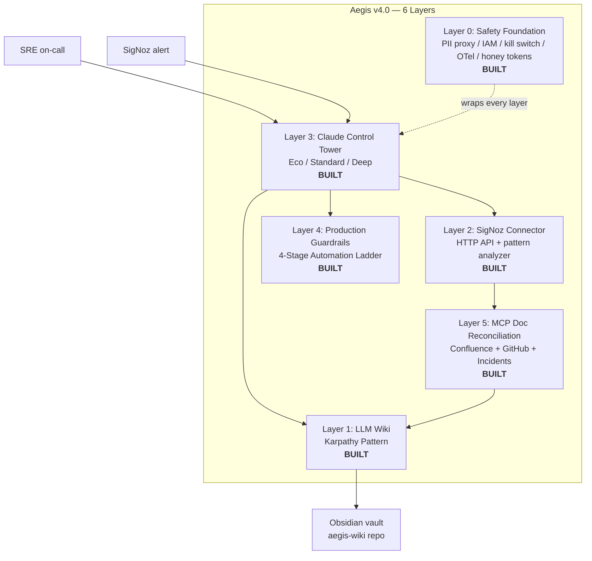

<div align="center">

# Aegis

### AI-Native DevSecOps Command Center

[](https://github.com/JIUNG9/aegis/actions)
[](LICENSE)
[](docs/ARCHITECTURE.md)
[](https://www.typescriptlang.org/)
[](https://nextjs.org/)
[](https://go.dev/)
[](https://python.org/)
[](https://www.anthropic.com/)

**An AI-native DevSecOps command center built on the Karpathy LLM Wiki pattern, not traditional RAG. Runs for about fifteen dollars a month.**

[Architecture](docs/ARCHITECTURE.md) | [Live wiki](https://github.com/JIUNG9/aegis-wiki) | [Article series](#read-the-series) | [Author](#about-the-author)

</div>

---

## Why Aegis

Most "AI for SRE" products are a retrieval-augmented chatbot pointed at a Confluence export. That design is fundamentally wrong for incident response. Chunk-based retrieval returns the three highest-scoring fragments and calls it context — and those fragments are usually stale, contradictory, or lifted from a runbook that no one has touched in two years. The agent answers confidently from a knowledge base it cannot evaluate. Aegis rejects that pattern.

Aegis uses the **LLM Wiki pattern** popularized by Andrej Karpathy: every source (runbook, post-mortem, Confluence page, resolved incident) is read exactly once by an LLM and synthesized into a canonical Obsidian page. Contradictions are flagged at ingest time. Staleness is tracked per source. The Control Tower queries pre-synthesized knowledge instead of raw chunks. The vault is public — it doubles as a portfolio artifact at [github.com/JIUNG9/aegis-wiki](https://github.com/JIUNG9/aegis-wiki), edited locally in Obsidian and auto-published.

The whole platform targets a specific constraint: **under fifteen dollars a month of recurring cost**. Claude Haiku 4.5 does the cheap synthesis work, Sonnet 4.6 does the reasoning, Opus only when the operator explicitly asks for it. SigNoz is OSS and self-hostable. Postgres, ClickHouse, and Redis run on a single VM. MCP (Model Context Protocol) is native, not bolted on. A four-stage automation ladder (Observe → Recommend → Low-Auto → Full-Auto) keeps the agent out of production until the operator trusts it.

---

## Architecture at a Glance



Full design document, component boundaries, trust model, and cost envelope: [docs/ARCHITECTURE.md](docs/ARCHITECTURE.md).

---

## Status

| Layer | Component | Status | Code path |
|-------|-----------|--------|-----------|
| 0 | PII redaction proxy (Claude API) | Built | `apps/ai-engine/proxy/` |
| 0 | Cloud IAM policy templates (AWS/GCP/Azure) | Built | `deploy/iam/` |
| 0 | Kill switch + `aegis panic` CLI | Built | `apps/ai-engine/killswitch/` |
| 0 | Local LLM router (Ollama fallback) | Built | `apps/ai-engine/llm_router/` |
| 0 | OTel GenAI tracing | Built | `apps/ai-engine/telemetry/` |
| 0 | Honey token beacon | Built | `apps/ai-engine/honeytokens/` |
| 0 | MCP tool scoping (read/write/blocked) | Built | `apps/ai-engine/mcp/manifest.py` |
| 0 | Demo mode (docker-compose + LocalStack + OTel) | Built | `deploy/demo/` |
| 1 | LLM Wiki (Karpathy pattern) | Built | `apps/ai-engine/wiki/` |
| 1 | Contradiction detector | Built | `apps/ai-engine/wiki/contradiction.py` |
| 1 | Staleness linter | Built | `apps/ai-engine/wiki/staleness.py` |
| 1 | Confluence sync | Built | `apps/ai-engine/wiki/confluence_sync.py` |
| 1 | SigNoz wiki sync | Built | `apps/ai-engine/wiki/signoz_sync.py` |
| 1 | Git publisher | Built | `apps/ai-engine/wiki/publisher.py` |
| 2 | SigNoz HTTP connector | Built | `apps/ai-engine/connectors/` |
| 2 | Time-based pattern analyzer | Built | `apps/ai-engine/connectors/pattern_analyzer/` |
| 3 | Claude Control Tower | Built | `apps/ai-engine/control_tower/` |
| 3 | Three-mode routing (Eco / Standard / Deep) | Built | `apps/ai-engine/control_tower/modes.py` |
| 4 | 4-stage automation ladder + policy engine | Built | `apps/ai-engine/guardrails/` |
| 4 | Risk classifier | Built | `apps/ai-engine/guardrails/risk.py` |
| 4 | Slack approval gate | Built | `apps/ai-engine/guardrails/approval.py` |
| 4 | Audit logger (SOC2 trail) | Built | `apps/ai-engine/guardrails/audit.py` |
| 5 | MCP docs reconciliation tools (4 read tools) | Built | `apps/ai-engine/mcp/tools/read/docs_*.py` |

### Phase 2 — Roadmap (next 4–6 weeks)

The 6-layer architecture is shipped and tested. Phase 2 turns Aegis from an *advisory* AI SRE into a *self-healing* one, plus closes the FinOps and operational gaps users have asked for.

| # | Component | Status | Effort | What it unlocks |
|---|---|---|---|---|
| P2.1 | Wire Control Tower into `main.py` (`/api/v1/investigate`) | Planned | ~2 hours | Live investigation endpoint; unblocks every Phase 2 feature below |
| P2.2 | MCP FinOps tool — Cost Explorer / OpenCost / Kubecost queries via MCP | Planned | ~1 day | Claude can answer cost questions; cost anomalies become first-class context |
| P2.3 | FinOps Excel/CSV export — `openpyxl` serializer + Download buttons | Planned | ~1 day | Costs leave the dashboard as spreadsheets your CFO can open |
| P2.4 | Periodic sync scheduler — APScheduler + tunable interval per connector | Planned | ~3 days | 24/7 background pulls; replaces "POST to sync" with autonomous polling |
| P2.5 | Layer 4 executor — turns `ProposedAction` into actually-run kubectl/terraform/aws commands under the 4-stage ladder | Planned | ~1 week | The thing that makes Aegis *self-healing* instead of advisory. Article #12 documents this. |

Frontend modules already shipped: Log Explorer, SLO Dashboard, FinOps, Incidents, Security, Deployments, On-Call, Services, IAM, Cloud Accounts, Settings (general, integrations, AI & tokens, team, safety). See `apps/web/src/app/(dashboard)/`.

---

## Quick Start

### Prerequisites

- Node.js 20+
- Go 1.22+
- Python 3.12+
- pnpm 9+
- Docker + Docker Compose (for Postgres, ClickHouse, Redis)
- Anthropic API key (for Layer 1 synthesis — set `ANTHROPIC_API_KEY`)

### Clone and boot

```bash
git clone https://github.com/JIUNG9/aegis.git
cd aegis
cp .env.example .env                  # fill in ANTHROPIC_API_KEY
pnpm install
docker compose up -d postgres clickhouse redis
pnpm dev
```

### Expected boot output

```
[docker] postgres      | ready on 5432
[docker] clickhouse    | ready on 8123
[docker] redis         | ready on 6379
[web]    Next.js 16.0  | ready on http://localhost:3000
[api]    Fiber         | listening on :8080
[ai]     uvicorn       | listening on :8000
[ai]     wiki engine   | loaded modules: ingester synthesizer contradiction staleness confluence_sync signoz_sync publisher
[ai]     wiki engine   | vault path: ./vault (0 pages)
[ai]     wiki engine   | budget: eco mode (Haiku 4.5), $15.00/mo cap
```

Open `http://localhost:3000`.

### Build / lint / test

```bash
pnpm build         # Turbo pipeline across web + api + ai-engine
pnpm lint          # ESLint (web), golangci-lint (api), ruff (ai-engine)
pnpm type-check    # tsc --noEmit across all TypeScript
pnpm test          # vitest + go test + pytest
```

---

## Repo Structure

```
aegis/
├── apps/
│   ├── web/               Next.js 16 + React 19 + Tailwind v4 frontend (11 dashboard modules)
│   ├── api/               Go + Fiber REST/WebSocket API, OIDC, 19 routes
│   └── ai-engine/         Python + FastAPI. Layer 1 shipped: wiki/ submodule is the heart of Aegis.
├── packages/
│   ├── types/             Shared TypeScript types consumed by web and integrations
│   ├── integrations/      Per-provider adapters (SigNoz, Datadog, PagerDuty, Slack, JIRA, GitHub)
│   └── ui/                shadcn/ui component wrappers + design tokens
├── docs/
│   ├── ARCHITECTURE.md    Full 5-layer architecture, trust model, cost envelope
│   └── architecture/      Per-layer design docs, ADRs, sequence diagrams
├── articles/              The 8-part Medium series with LinkedIn post drafts per article
├── infra/                 Terraform + Helm + docker-compose. Code-only — never applied from CI.
└── scripts/               Dev utilities (seed vault, replay incidents, benchmark synthesis cost)
```

---

## Read the Series

The design decisions, trade-offs, and implementation details behind Aegis are documented as an eight-part Medium series. Every article maps to a real module in this repository and includes links back to the source.

| # | Title | One-liner |
|---|-------|-----------|
| 1 | [Karpathy Killed RAG](articles/01-karpathy-killed-rag/article.md) | Why the LLM Wiki pattern beats chunk-based retrieval for operational knowledge. |
| 2 | [Your AI Agent Is Lying](articles/02-ai-is-lying/article.md) | MCP tools that find contradictions between runbooks, Confluence, and post-mortems. |
| 3 | [A Self-Maintaining SRE Knowledge Base](articles/03-self-maintaining-kb/article.md) | The Obsidian vault that updates itself from incident and source activity. |
| 4 | [The 4-Stage Automation Ladder](articles/04-automation-ladder/article.md) | Observe → Recommend → Low-Auto → Full-Auto. Trust is earned, not configured. |
| 5 | [Claude + MCP Replaced Our 3 AM Pager](articles/05-claude-mcp-pager/article.md) | A full investigation loop for fifteen dollars a month. |
| 6 | [80% of Incidents on Monday 9 AM](articles/06-monday-patterns/article.md) | Time-based pattern analysis that pre-positions recommendations. |
| 7 | [Production Guardrails Across 4 AWS Accounts](articles/07-multi-account-guardrails/article.md) | Risk tiers, dry-run, rollback-first, SOC2-ready audit trail. |
| 8 | [Open-Sourcing Aegis](articles/08-open-sourcing-capstone/article.md) | The career capstone: SRE by day, platform author by night. |
| 9 | [PII-Redacting Proxy for Claude](articles/09-pii-proxy-for-claude/article.md) | Layer 0.1 — stopping real prod data from crossing to Anthropic's servers. |
| 10 | [Honey Tokens + Kill Switches](articles/10-honey-tokens-killswitches/article.md) | Layer 0.3 + 0.6 — tripwires that catch LLM leaks + an `aegis panic` CLI. |
| 11 | [Deploying AI in a Regulated Enterprise (PIPA Case Study)](articles/11-pipa-case-study/article.md) | Layer 0.4 + Tier C — how Aegis stays on the right side of Korean PIPA. |

Each article directory also contains a `linkedin-post.md` with three variants (technical, career, hot-take) ready to post.

---

## Related Repos

- **[github.com/JIUNG9/aegis-wiki](https://github.com/JIUNG9/aegis-wiki)** — the live, sanitized Obsidian vault published by the Aegis LLM Wiki Engine. This is what a self-maintaining SRE knowledge base looks like in practice. Recruiters and reviewers: start there.

---

## Design System

Dark-first terminal aesthetic. JetBrains Mono for code and headings, Inter for body. Six color presets (Matrix, Cyan, Amber, Violet, Red, Frost). Three density modes (Compact, Comfortable, Spacious). Large components by default — metrics at 32px+, charts at 300px+, the dashboard fills the available space. Details in `packages/ui/tokens.ts` and `apps/web/src/app/globals.css`.

---

## Integrations

Plugin architecture under `packages/integrations/`:

| Category | Providers |
|----------|-----------|
| Observability | SigNoz (primary), Datadog, Prometheus, Grafana, CloudWatch |
| Incident | PagerDuty, Opsgenie, Slack, Microsoft Teams |
| Ticketing | JIRA, Linear, GitHub Issues |
| Cloud | AWS, GCP, Azure, NCloud (NAVER Cloud) |
| Cost | OpenCost, Kubecost, AWS Cost Explorer |
| Security | Trivy, Snyk, Grype |
| CI/CD | GitHub Actions, CircleCI, ArgoCD |
| Source | GitHub, GitLab, Bitbucket |

All integrations use read-only IAM where infrastructure is involved. Aegis never provisions or mutates cloud resources — it observes, analyzes, and recommends. Any write action routes through the Layer 4 guardrails.

---

## Cost Envelope

| Component | Monthly cost | Notes |
|-----------|--------------|-------|
| Claude Haiku 4.5 (wiki synthesis) | $0.50–$2 | 100-page vault, daily sync |
| Claude Sonnet 4.6 (investigations) | $5–$10 | ~1 incident/day at $0.08 each |
| Claude Opus 4.6 (deep analysis) | $0–$2 | Operator-triggered only |
| SigNoz (self-hosted) | $0 | OSS, runs on the same VM |
| Postgres + ClickHouse + Redis | $0 | Docker Compose on operator's box |
| **Total** | **~$15** | Target: under the cost of one Datadog seat |

Budget guardrails in `apps/web/src/app/(dashboard)/settings/` auto-downgrade to Eco at configurable thresholds. See [docs/ARCHITECTURE.md#cost-envelope](docs/ARCHITECTURE.md).

---

## About the Author

**June Gu** (Jiung Gu). Site Reliability Engineer at [Placen](https://placen.kr), a subsidiary of NAVER Corporation. Previously at Coupang (NYSE: CPNG), Hyundai IT&E, and Lotte Shopping. Aegis is a nights-and-weekends project built while operating multi-account AWS infrastructure, EKS clusters, and PostgreSQL fleets at day-job scale. Relocating to Canada in 2027.

- LinkedIn: [linkedin.com/in/jiung-gu](https://linkedin.com/in/jiung-gu)
- Medium: [medium.com/@junegu](https://medium.com/@junegu)
- GitHub: [github.com/JIUNG9](https://github.com/JIUNG9)

---

## Contributing

Contributions welcome. See [CONTRIBUTING.md](CONTRIBUTING.md) for the branch-naming convention, commit style (Conventional Commits), and local development setup. The short version:

```bash
git checkout -b feat/my-feature
# ... make changes ...
git commit -m "feat(wiki): add my feature"
git push origin feat/my-feature
# open PR against main
```

Branch prefixes: `feat/`, `fix/`, `docs/`, `refactor/`, `perf/`, `test/`, `ci/`, `chore/`.

---

## License

MIT. See [LICENSE](LICENSE). Fork it, self-host it, point your own LLM Wiki Engine at your own runbooks.

---

<div align="center">

Built by [June Gu](https://github.com/JIUNG9) — SRE at Placen (NAVER Corporation), Ex-Coupang.

</div>
