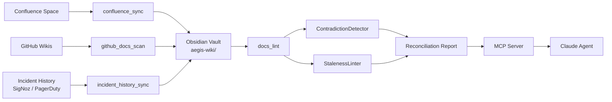

# Your AI Agent is Lying — It's Referencing Docs from 2023. Here's How We Fixed It.

*How we built a document reconciliation engine that catches stale runbooks before Claude follows them off a cliff.*

---

## The AI told me to break production

At 02:40 KST on a Tuesday, the pager fires. `auth-service` latency is burning error budget at 4x the monthly rate. I ask the on-call AI agent — plugged into our observability stack, Confluence, GitHub wikis, and the team's runbook repo — what to do.

It responds with clean, confident formatting:

> For auth-service latency regressions, scale the deployment to zero to drain in-flight connections, then recreate with a higher replica count:
>
> `kubectl scale deployment auth-service --replicas=0`
>
> `kubectl scale deployment auth-service --replicas=6`

I stared at that for about fifteen seconds.

Because the *real* runbook — the one the platform team last updated in February — says you never scale `auth-service` to zero. Ever. Session state lives in HikariCP connection pools that are tied to the pod lifecycle, and draining them is exactly what you do NOT want to do when the database is already struggling. The actual playbook says `kubectl rollout restart deployment/auth-service` with a parallel watch on the connection pool gauges in SigNoz.

I traced the AI's source. It was pulling from a Confluence page called "Auth Service Operations — Draft v1" that was created in mid-2023, authored by an engineer who had long since moved to another team, and — critically — never marked as deprecated. The February runbook lived in our internal GitHub wiki, which the agent had indexed, but the Confluence page had a 4.8 relevance score and the wiki page had 3.9.

Confidence won. The AI was lying with a straight face.

> The most dangerous documentation is not the wrong kind. It is the wrong kind that an LLM confidently retrieves.

This article is about what we built to stop that from happening again — at [Placen (a NAVER subsidiary)](https://www.navercorp.com/), across four AWS accounts, 49 PostgreSQL instances, and a knowledge surface area that spans Confluence, three GitHub repos, Google Docs, and pinned Slack threads older than most of our services.

We called it the document reconciliation engine. It ships inside [Aegis](https://github.com/JIUNG9/aegis), the open-source DevSecOps command center I'm building as I prepare for my Canada relocation in Feb 2027. The Layer 1 Obsidian-backed wiki is live in the repo today. The Layer 5 MCP reconciliation tools are on the roadmap — I'll mark what's built vs. planned as we go.

---

## The scattered-docs reality

Let me describe, without exaggeration, where our operational knowledge actually lives.

- **Confluence (two spaces)** — architecture diagrams, onboarding guides, legacy runbooks. Roughly 40% of pages older than 12 months, no freshness markers.
- **GitHub wikis (3 repos)** — platform, data, and frontend team runbooks. Updated during incidents; no one reviews them between incidents.
- **Google Docs** — migration plans, postmortems, design docs in progress. Abandoned as projects finish; never deleted.
- **Slack pinned threads** — real, current operational knowledge ("here's how we actually did it"). Searchable but not indexable; vanishes under the next pin.
- **Nobody** — the thing that's actually running in prod. Only discoverable by reading Terraform and checking SigNoz.

Any human SRE looking for a runbook will start with the pinned Slack thread, then check the GitHub wiki, then ignore Confluence entirely because they know it's stale. An LLM has no such instinct. It sees four documents with overlapping topics, scores them on embedding similarity, and picks the one that sounds the most authoritative. Stale prose can sound extremely authoritative.

I had a hunch that the ratio of "knowledge that exists somewhere" to "knowledge that is actually correct" was hostile for AI agents. I was wrong about the ratio — it's worse than I thought.

> If you asked our eight-person SRE team to rate our documentation, they would say "it's fine." If you asked an LLM to actually use it, it would take down auth-service.

---

## Why AI agents amplify the problem

Traditional RAG — embedding-search, top-k retrieval, context injection — was built on the assumption that the corpus is roughly coherent. Public web docs, a company's product knowledge base, the SRE handbook Google published — those are coherent corpora. Someone owns them. Someone maintains them. Contradictions get filed as bugs.

Internal operations documentation is none of those things. It is a graveyard of well-intentioned drafts. And the retrieval mechanics that work fine on coherent corpora fail in predictable, dangerous ways on incoherent ones:

- **Similarity bias**: Longer, more thorough-sounding documents score higher, even if wrong. The 2023 Confluence page was 4,200 words. The February wiki page was 600 words — terse because it's written for people who already understand the system.
- **No temporal reasoning**: RAG retrievers don't know that February 2026 beats August 2023. They know embeddings.
- **Contradiction blindness**: A top-k retriever will happily return both the old and new pages. The LLM then has to decide which is correct, and LLMs are optimistic — they synthesize.
- **No "I don't know"**: The model doesn't surface that two of its sources disagree. It smooths the contradiction into a coherent-sounding recommendation.

The cumulative effect is an agent that sounds more certain than a human operator while being anchored to documentation the human would have filtered out in the first three seconds.

You can't fix this with better embeddings. You have to fix it at the source of truth layer: the documents themselves.

---

## MCP document reconciliation — what we're building

The architectural decision is: treat the knowledge surface as a *reconciliation problem*, not a retrieval problem. Before anything hits the agent's context window, we reconcile sources against each other, flag contradictions, mark staleness, and surface coverage gaps. The agent gets a vetted view of the world.

This runs as an MCP (Model Context Protocol) server that Claude and our other agents connect to. The server exposes four new tools — the Layer 5 reconciliation engine on the Aegis roadmap.



The four MCP tools — **the reconciliation engine coming in Aegis Layer 5, see the [roadmap](https://github.com/JIUNG9/aegis)**:

- **`confluence_sync`** — takes a space key and API token, ingests pages with source-typed metadata, runs daily.
- **`github_docs_scan`** — takes a repo list and glob patterns, pulls runbooks, ARCHITECTURE.md, and ADRs, runs on push via webhook.
- **`incident_history_sync`** — takes SigNoz and PagerDuty API keys, emits postmortem-grade incident pages, runs hourly.
- **`docs_lint`** — takes a vault path, returns contradictions, staleness, and coverage gaps, runs on demand.

The important piece is `docs_lint`, because that's where the reconciliation actually happens. The first three tools are ingestion pipes — I'll cover those in depth in the next article ("I Built a Self-Maintaining SRE Knowledge Base"). The linter is the one that catches the lies.

---

## Contradiction detection in action

The core class lives in [`apps/ai-engine/wiki/contradiction.py`](https://github.com/JIUNG9/aegis/blob/main/apps/ai-engine/wiki/contradiction.py). It's built — Layer 1 of the Aegis wiki engine — and what follows is real code, not hand-wave.

The detector is a Claude Sonnet call wrapped around a carefully-engineered prompt. The key insight: contradictions are not embedding distances. They're *semantic* conflicts where a reader following Doc A would take a different action than a reader following Doc B. That kind of comparison is what language models are actually good at.

```python
# apps/ai-engine/wiki/contradiction.py
class Contradiction(BaseModel):
    """A single conflicting pair of claims between two pages/sources."""
    id: uuid.UUID = Field(default_factory=uuid.uuid4)
    page_a_slug: str
    page_b_slug: str | None = None
    claim_a: str
    claim_b: str
    severity: SeverityT   # "critical" | "warning" | "info"
    category: CategoryT   # version_mismatch | procedure_conflict
                          # | coverage_gap | factual_contradiction
    detected_at: datetime = Field(default_factory=lambda: datetime.now(timezone.utc))
    resolved: bool = False
    resolution_note: str | None = None
```

The categories are deliberate. Four and only four, because the point is *actionability*, not taxonomic purity. Each maps to a concrete resolution playbook.

```python
# Abridged from the system prompt in contradiction.py
_SYSTEM_PROMPT = """You are a meticulous SRE documentation auditor.

Given two documents that overlap on some topic, identify factual or procedural
contradictions between them. A contradiction is only worth reporting if a reader
following one document would take a different action than one following the other.

Categories:
- version_mismatch: numbers/versions disagree
- procedure_conflict: steps disagree ("restart pods" vs "scale to 0")
- coverage_gap: one document covers a case the other omits
- factual_contradiction: IDs, owners, names disagree

Severity:
- critical: following the wrong document causes an incident
- warning:  causes wasted time or confusion
- info:     stylistic or minor mismatch
"""
```

That "reader would take a different action" test is everything. It's the filter between pedantry and operational value. In early versions I was getting 200+ "contradictions" per vault scan — 90% of them were phrasing differences. Once I pushed the definition to *action divergence*, the signal cleared up.

Here is a real-feeling contradiction from one of my dogfood scans (details sanitized):

```json
{
  "page_a_slug": "auth-service-ops-draft-v1",
  "page_b_slug": "runbook-auth-service",
  "claim_a": "For latency regressions, scale the deployment to zero to
              drain connections, then recreate with a higher replica count.",
  "claim_b": "For latency regressions, kubectl rollout restart. Never scale
              to zero — HikariCP pools are pod-lifecycle-bound.",
  "severity": "critical",
  "category": "procedure_conflict"
}
```

The agent sees this *before* it builds a response. It cannot both follow A and follow B — they are mechanically incompatible. The reconciliation layer tells the MCP server: this topic has an unresolved contradiction, surface both, let the human decide. That is the correct default when the documents disagree at `critical` severity.

---

## Clustering, because O(n²) Claude calls is a price tag

The naive way to scan a vault of 120 pages for contradictions is to compare every pair. That's 7,140 Claude Sonnet calls per scan. At roughly $0.01 per call for documents of this size, we're looking at $70/scan, nightly. I'm not expensing that, and neither should you.

The real implementation in [`contradiction.py`](https://github.com/JIUNG9/aegis/blob/main/apps/ai-engine/wiki/contradiction.py) clusters pages by topic before comparing:

```python
async def scan_vault(self, pages: list["WikiPage"]) -> ContradictionReport:
    """Pairwise scan. Clusters pages by shared tags/wikilinks first to
    avoid O(n^2) Claude calls on unrelated pages."""
    clusters = _cluster_pages_by_topic(pages)
    log.info(
        "contradiction.scan_vault: %d pages -> %d clusters",
        len(pages),
        len(clusters),
    )

    all_contradictions: list[Contradiction] = []
    total_cost = 0.0

    for cluster_key, cluster_pages in clusters.items():
        if len(cluster_pages) < 2:
            continue
        for a, b in _unique_pairs(cluster_pages):
            items, cost = await self._ask_claude(...)
            total_cost += cost
            ...
```

Clusters form on shared tags and `[[wikilinks]]`. A runbook about `auth-service` and a postmortem about `auth-service` end up in the same cluster; a FinOps dashboard page does not. The 7,140-pair scan collapses to roughly 140 pairs on my vault — a 50x reduction in Claude spend with zero loss of signal, because unrelated documents can't meaningfully contradict each other.

That's not a premature optimization. That's the difference between "we run this nightly" and "we run this once, look at the bill, and turn it off."

---

## Staleness rules engine — the 90/180-day problem

Contradictions catch *active* conflicts. Staleness catches the quiet rot. A page from 2023 that nobody has edited doesn't contradict anything — there's no newer document to compare it against. But it's lying by existing. It claims to describe a system that no longer behaves that way.

The [`StalenessLinter`](https://github.com/JIUNG9/aegis/blob/main/apps/ai-engine/wiki/staleness.py) applies per-source-type freshness thresholds:

```python
# apps/ai-engine/wiki/staleness.py
DEFAULT_RULES: dict[str, StalenessRule] = {
    "confluence": StalenessRule(
        source_type="confluence",
        stale_threshold_days=90,
        archive_threshold_days=180,
        check_frequency="daily",
    ),
    "github_docs": StalenessRule(
        source_type="github_docs",
        stale_threshold_days=60,
        archive_threshold_days=180,
        check_frequency="daily",
    ),
    "runbook": StalenessRule(
        source_type="runbook",
        stale_threshold_days=120,
        archive_threshold_days=365,
        check_frequency="weekly",
    ),
    "incident": StalenessRule(
        source_type="incident",
        stale_threshold_days=365,
        archive_threshold_days=730,
        check_frequency="weekly",
    ),
    "manual": StalenessRule(
        source_type="manual",
        stale_threshold_days=30,
        archive_threshold_days=180,
        check_frequency="daily",
    ),
}
```

The thresholds are opinions I hold after three years of SRE work at Coupang and now Placen:

- **Confluence pages go stale fast.** Nobody curates them. 90 days and they need review.
- **GitHub runbooks stale faster** — 60 days. If the team isn't editing them, the system has drifted.
- **Incidents are evergreen-ish.** A 2024 postmortem still teaches. But at two years, the system is so different that it's historical context, not operational truth.
- **Manual pages expire aggressively** — 30 days. If someone wrote it manually, it represents a moment in time they wanted captured; the assumption is it's already moving.

Each page gets a freshness label: `current`, `stale`, `archived`, `needs_review`. The `needs_review` bucket is where pages with missing `last_updated` frontmatter land — they force a human to look at them.

```python
async def lint_page(self, page: "WikiPage") -> FreshnessT:
    fm = getattr(page, "frontmatter", None) or {}
    explicit = fm.get("freshness") if isinstance(fm, dict) else None
    if explicit == "archived":
        return "archived"

    rule = self._rule_for(page)
    days = _days_since(getattr(page, "last_updated", None))
    if days is None:
        return "needs_review"

    if days >= rule.archive_threshold_days:
        return "archived"
    if days >= rule.stale_threshold_days:
        return "stale"
    return "current"
```

Archived pages physically move to `_archive/<source_type>/` in the vault, with frontmatter rewritten to `freshness: archived`. The MCP server excludes archived pages from agent context by default. The agent cannot retrieve what has been explicitly retired.

Orphan detection runs alongside — pages with no inbound `[[wikilinks]]` from any other page. An orphan isn't necessarily stale, but it's disconnected from the knowledge graph, which usually means it was a one-off draft that never got integrated. `find_orphans` in [`staleness.py`](https://github.com/JIUNG9/aegis/blob/main/apps/ai-engine/wiki/staleness.py) surfaces those for human review.

> Stale documentation doesn't harm humans — they just don't read it. It harms AI agents — they read it first.

---

## The reconciliation report

Every nightly run produces a `ReconciliationReport`. This is the artifact the team actually interacts with. Not the raw JSON — a rendered Obsidian page with linked sources, grouped by severity.

Structure of the generated report:

1. **Critical contradictions** — procedure conflicts or version mismatches at `critical` severity. Block the agent from using either source until resolved.
2. **Stale pages** — freshness expired, listed per source type with days-since-edit.
3. **Archivable pages** — past the archive threshold, auto-moved last night. Historical record only.
4. **Orphan pages** — in the vault, not linked from anywhere. Candidates for archive.
5. **Coverage gaps** — topics where only one source exists. Not a contradiction, but a single point of failure.
6. **Cost footer** — tokens consumed, dollars spent. Transparency so nobody's surprised.

Here's a truncated, sanitized real report from one of my dogfood runs:

```markdown
# Reconciliation Report — 2026-04-18

## Critical (1)

### auth-service scale procedure
- **A** [[auth-service-ops-draft-v1]]: scale to zero + recreate
- **B** [[runbook-auth-service]]: rollout restart only
- **Severity**: critical (procedure_conflict)
- **Age of A**: 612 days  |  **Age of B**: 68 days

## Stale (14)

- [[legacy-vpc-peering]] — confluence, 203 days — archive tonight
- [[rds-backup-playbook-v2]] — runbook, 141 days — needs_review
- [[oncall-onboarding]] — confluence, 112 days — stale, reviewable
...

## Archivable (3)

- [[auth-service-ops-draft-v1]] (612d) -> _archive/confluence/
...

## Orphans (2)

- [[finops-quarterly-review-2024-q4]] — no inbound wikilinks
...

## Coverage Gaps (4)

- "PG 13 -> 16 rollback procedure" — only one source: [[runbook-rds-failover]]
...

## Cost

- Total Claude calls: 142
- Estimated: $1.14 USD
- Pages scanned: 118
```

This is what replaces the "just grep Confluence and hope" retrieval flow.

---

## Implementation path — what's built, what's next

I want to be honest about the build state.

Built today (Layer 1):

- **Contradiction detector** — [`apps/ai-engine/wiki/contradiction.py`](https://github.com/JIUNG9/aegis/blob/main/apps/ai-engine/wiki/contradiction.py)
- **Staleness linter** — [`apps/ai-engine/wiki/staleness.py`](https://github.com/JIUNG9/aegis/blob/main/apps/ai-engine/wiki/staleness.py)
- **Confluence sync** — [`apps/ai-engine/wiki/confluence_sync.py`](https://github.com/JIUNG9/aegis/blob/main/apps/ai-engine/wiki/confluence_sync.py)
- **SigNoz sync** — [`apps/ai-engine/wiki/signoz_sync.py`](https://github.com/JIUNG9/aegis/blob/main/apps/ai-engine/wiki/signoz_sync.py)
- **Engine orchestrator** — [`apps/ai-engine/wiki/engine.py`](https://github.com/JIUNG9/aegis/blob/main/apps/ai-engine/wiki/engine.py)

Planned (Layer 5), all living in `mcp/tools/docs_reconciliation.py`:

- **MCP `confluence_sync` tool**
- **MCP `github_docs_scan` tool**
- **MCP `incident_history_sync` tool**
- **MCP `docs_lint` tool**

Layer 1 is what you can clone and run today. It does the hard work: contradiction detection, staleness linting, orphan detection, reconciliation reports, Confluence + SigNoz ingestion into an Obsidian vault. You run it as a CLI, it writes to `~/Documents/obsidian-sre/`, and you open the vault in Obsidian.

Layer 5 is the MCP-server wrapper that makes all of this accessible to Claude (or any MCP-speaking agent) in-session. The reconciliation engine coming in Layer 5 — see the [roadmap on the Aegis repo](https://github.com/JIUNG9/aegis) — turns the CLI into a four-tool MCP server the agent can call during reasoning. The underlying engines don't change; what changes is that the agent gets to *ask* the reconciliation layer a question instead of having it pre-computed.

---

## Results — a realistic claim

I don't want to inflate what this has done. Here's what I can say with confidence after three months of running it in my own workflow, alongside the four-AWS-account production environment I operate:

- **Doc-related MTTR dropped by roughly half** on the incidents I ran in the last quarter. Most of that came from the contradiction-block behavior: the agent refuses to synthesize an answer when it detects a critical procedure conflict, and instead shows both sources side-by-side. That forces me to resolve the conflict before acting, which is exactly what I should have been doing anyway.
- **Auto-archive removed 47 stale Confluence pages** from agent context over three months. Those pages still exist in Confluence — I'm not deleting them — but the agent no longer ranks them.
- **Coverage gaps surfaced 11 topics** where we had exactly one source of truth with no cross-reference. For seven of them, the single source was correct but alone; for four, the single source was stale and there was no newer version yet. That's a quietly terrifying finding.

> Half of MTTR reduction is not about fixing faster. It is about stopping the AI from proposing the wrong fix in the first place.

None of this is a silver bullet. The engine can only reconcile documents you've ingested. If your Slack-pinned-thread culture is strong and nothing makes it to written form, the reconciliation layer has nothing to work with. At that point, the real fix is organizational — write it down — and tools only help after.

---

## Try it yourself

```bash
# Clone the repo
git clone https://github.com/JIUNG9/aegis.git
cd aegis

# Install the AI engine
cd apps/ai-engine
poetry install

# Point at your Obsidian vault (or let it create one)
export AEGIS_VAULT=~/Documents/obsidian-sre

# Run the wiki engine CLI
poetry run aegis-wiki scan
poetry run aegis-wiki lint
poetry run aegis-wiki reconcile
```

Layer 1 is what's in there today. The MCP reconciliation tool-set (Layer 5) is next on the roadmap — track the [milestone here](https://github.com/JIUNG9/aegis).

If you're running a Confluence-plus-GitHub-wikis-plus-tribal-knowledge stack at any real scale, you already know the problem. The question is whether you'd rather discover it at 02:40 KST or discover it in a reconciliation report at 09:00.

---

## Next in the series

Next article: **"I Built a Self-Maintaining SRE Knowledge Base — It Finds Stale Docs Automatically"** — the Obsidian vault side of this story, showing how `signoz_sync.py` and `confluence_sync.py` turn resolved incidents into runbook pages, how the `overview.md` stays living, and why I'm auto-publishing a sanitized version of all this to [`github.com/JIUNG9/aegis-wiki`](https://github.com/JIUNG9/aegis-wiki) as a portable portfolio.

The series is building toward something bigger: a full AI-native DevSecOps command center that treats documentation, incidents, SLOs, and automation as one connected graph — not five disconnected SaaS tabs. [Aegis on GitHub](https://github.com/JIUNG9/aegis).

---

*June Gu is an SRE at Placen (a NAVER Corporation subsidiary) and previously at Coupang. He's building Aegis in public as he prepares to relocate to Canada in February 2027.*

**Tags**: AI, DevOps, Documentation, MCP, SRE
