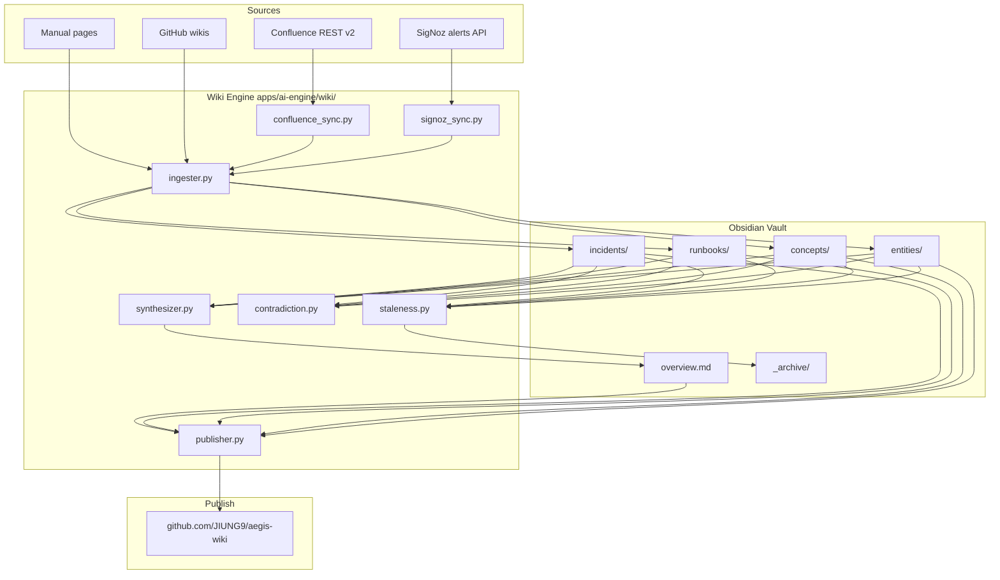

# I Built a Self-Maintaining SRE Knowledge Base — It Finds Stale Docs Automatically

*Runbooks that update themselves when incidents resolve. A vault that archives its own dead pages. A public portfolio that never drifts from what I actually operate.*

---

## The knowledge base updates itself

When a new incident resolves in SigNoz, the knowledge base writes the postmortem into the right runbook. When Confluence adds a page, the knowledge base merges the new knowledge into the existing topic. When a document hasn't been touched in 180 days, the knowledge base quietly moves it to `_archive/` and stops serving it to AI agents. The `overview.md` file at the vault root — the one index that ties everything together — rebuilds itself after every sync, preserving my manual notes above a fence and synthesizing everything else below.

This isn't a thought experiment. It's what I run on my own machine today, and a sanitized mirror of it lives in public at [github.com/JIUNG9/aegis-wiki](https://github.com/JIUNG9/aegis-wiki). It's the documentation substrate for [Aegis](https://github.com/JIUNG9/aegis), the open-source DevSecOps command center I'm building as I prepare to relocate to Canada.

> Runbooks rot not because anyone is lazy. Runbooks rot because nobody owns them, and ops teams are too busy keeping production alive to curate prose.

This article walks through how the self-maintaining vault works — the directory structure, the auto-sync jobs, the freshness tracking — and ends with an angle I don't see covered enough in SRE writing: **what it looks like when your knowledge base is also your portfolio.**

---

## Why runbooks rot

Let me describe the pattern at almost every company I've worked at, including [Coupang](https://www.coupang.jobs/), [Hyundai IT&E](https://www.hyundai-itne.com/), and [Placen (a NAVER Corporation subsidiary)](https://www.navercorp.com/).

1. An incident happens.
2. Someone writes a runbook during the post-mortem.
3. The runbook is pristine for 30 days.
4. A dependency changes. The runbook is now 10% wrong.
5. Nobody updates it. They fix the runbook in their head, next time.
6. Six months later the runbook is 40% wrong.
7. A new engineer joins, reads the runbook, gets confused, asks on Slack.
8. The Slack answer becomes the new runbook. In Slack. Unsearchable.
9. The written runbook gets ignored. It is now a liability — authoritative-looking, actually wrong.

This loop is structural. SRE teams are optimized to keep systems alive, not to maintain documentation artifacts. You cannot solve it by asking engineers to be more disciplined. You solve it by making the artifacts maintain themselves as a side effect of the work that is already happening.

Every time an alert fires in SigNoz and resolves, that is a signal — something happened, it got fixed, the knowledge is fresh in someone's head. Every time a Confluence page changes, that is a signal. Every time somebody touches a runbook in git, that is a signal. The self-maintaining knowledge base is just the observation that these signals already exist; we just weren't plumbing them anywhere useful.

> A knowledge base that requires humans to keep it up to date is a knowledge base that will always be out of date.

---

## The Obsidian vault architecture

The whole system is an Obsidian vault. Markdown files, YAML frontmatter, `[[wikilinks]]`, no database, no special client. You can open it on your phone in any markdown editor. You can grep it. You can commit it to git. When things go wrong, you can fix them with a text editor.

This was a deliberate choice. Every "knowledge management platform" I've used at work — Confluence, Notion, internal wikis — ends up becoming the problem. Lock-in, bad search, brittle APIs, subtle formatting breakage on export. Obsidian is just files. If Obsidian disappeared tomorrow, the vault would still work in vim.

```
~/Documents/obsidian-sre/
├── overview.md              # Living synthesis, rebuilt after every sync
├── README.md                # Vault conventions
├── entities/                # Concrete things (services, clusters, accounts)
│   ├── auth-service.md
│   ├── prod-eks-cluster.md
│   ├── rds-aurora-postgres.md
│   └── signoz-observability.md
├── concepts/                # Abstractions (SLOs, error budgets, patterns)
│   ├── error-budget.md
│   ├── hub-spoke-aws.md
│   └── blue-green-deployment.md
├── runbooks/                # What to do when X happens
│   ├── runbook-auth-service.md
│   ├── runbook-rds-failover.md
│   └── runbook-eks-node-drain.md
├── incidents/               # Postmortems, auto-generated from SigNoz
│   ├── INC-EXAMPLE-001.md
│   └── INC-EXAMPLE-002.md
├── _archive/                # Auto-moved stale pages (freshness: archived)
├── _templates/              # New-page scaffolds
└── _meta/                   # Sync state, reports, never rendered
    ├── sync-state.json
    ├── contradictions.json
    └── staleness-report.json
```

Four page *kinds* — `entity`, `concept`, `runbook`, `incident` — map to four folders. Every page has a frontmatter block declaring its kind, sources, freshness, and tags:

```yaml
---
title: auth-service
type: entity
last_updated: 2026-04-18T09:12:00Z
sources:
  - signoz:rule-auth-p99-latency
  - confluence:PLATFORM:123456
  - github:aegis/apps/api/auth
freshness: current
tags: [service, spring-boot, platform]
aliases: [auth, auth-svc]
---

# auth-service

Spring Boot microservice. Handles OIDC flows through Keycloak, maintains
session state in HikariCP connection pools pinned to pod lifecycle.

> **Scale policy**: never `kubectl scale --replicas=0`. Use
> `kubectl rollout restart`. See [[runbook-auth-service]].

## Dependencies
- [[rds-aurora-postgres]] for user records
- [[signoz-observability]] for RED metrics

## Recent incidents
- [[INC-EXAMPLE-001]] — HikariCP pool exhaustion (2026-02-10)
```

The `sources` array is what makes all of this work. Each source is a URI the sync engine can re-read. When SigNoz emits a new resolved alert on `rule-auth-p99-latency`, the Ingester knows which page to extend. When Confluence edits `PLATFORM:123456`, the new version gets merged in. The page is a view over multiple sources, not a hand-written document.

---

## Auto-sync from SigNoz — incidents become runbooks

The [`signoz_sync.py`](https://github.com/JIUNG9/aegis/blob/main/apps/ai-engine/wiki/signoz_sync.py) module runs hourly. It pulls resolved incidents from SigNoz's `/api/v1/alerts` endpoint, enriches each one with the underlying rule definition (the query and thresholds that fired), and feeds the merged payload to the Ingester.

```python
# apps/ai-engine/wiki/signoz_sync.py
class SignozConfig(BaseModel):
    """Connection + scheduling configuration for a SigNoz instance."""
    base_url: str
    api_key: SecretStr
    sync_frequency: Literal["hourly", "daily", "manual"] = "hourly"
    lookback_days: int = 30


class SignozSyncResult(BaseModel):
    synced_at: datetime = Field(
        default_factory=lambda: datetime.now(timezone.utc)
    )
    alerts_fetched: int = 0
    incidents_ingested: int = 0
    errors: list[str] = Field(default_factory=list)
```

The trick is deduplication. Rerunning a sync can't re-ingest the same incident twice or the vault explodes. The manifest lives at `_meta/signoz-synced.json` and keys on the incident_id SigNoz assigns:

```json
{
  "last_sync": "2026-04-18T09:00:00Z",
  "synced_incidents": {
    "6a2c9e1f-...": {
      "slug": "INC-EXAMPLE-001",
      "rule_id": "rule-auth-p99-latency",
      "first_fired_at": "2026-02-10T04:22:00Z",
      "resolved_at": "2026-02-10T05:09:00Z",
      "ingested_at": "2026-02-10T06:00:00Z"
    }
  }
}
```

If the incident_id changes upstream — which happens rarely but does happen — the sync treats it as new and a human gets a duplicate. That's the right failure mode. Silent merging into the wrong page is worse than a visible duplicate.

The generated incident page looks like this:

```markdown
---
title: INC-EXAMPLE-001
type: incident
last_updated: 2026-02-10T06:00:00Z
sources: [signoz:6a2c9e1f-...]
freshness: current
tags: [incident, auth-service, p2]
---

# INC-EXAMPLE-001 — auth-service p99 latency regression

**Service**: [[auth-service]]
**Severity**: P2
**Duration**: 47 minutes

## Timeline
- 04:22 KST — Alert fired on `rule-auth-p99-latency` (p99 > 2s for 5m)
- 04:31 KST — On-call paged, investigation started
- 04:47 KST — Identified HikariCP pool exhaustion
- 05:09 KST — `kubectl rollout restart` resolved

## Fired rule
Query: `histogram_quantile(0.99, sum by (le) (...)...)`
Threshold: > 2000ms for 5m

## Related
- [[auth-service]]
- [[runbook-auth-service]]
- [[rds-aurora-postgres]]
```

Notice what's missing: no hand-typed narrative. The generated pages are intentionally minimal — just the facts SigNoz knows. Anything richer goes in `## Manual notes` above the auto-generated fence, the same pattern `overview.md` uses.

---

## Auto-sync from Confluence — pages merge into topics

Confluence is trickier than SigNoz because it emits prose, not structured events. The [`confluence_sync.py`](https://github.com/JIUNG9/aegis/blob/main/apps/ai-engine/wiki/confluence_sync.py) module walks every page in a space via the REST API v2, feeds the body through the Ingester, and tracks the page_id so upstream deletions can be reflected locally.

```python
# apps/ai-engine/wiki/confluence_sync.py
class ConfluenceConfig(BaseModel):
    base_url: str
    space_key: str
    api_token: SecretStr
    email: str
    sync_frequency: Literal["hourly", "daily", "weekly", "manual"] = "daily"
```

The interesting behavior is what happens when a Confluence page is deleted upstream. The manifest at `_meta/confluence-synced.json` knew about it. The sync can see it's gone. A naive implementation would delete the vault page. That's wrong — the knowledge it contained might still be valid and other pages might link to it. The correct behavior is to flag it `archived` locally and leave the file in place so `[[wikilinks]]` don't break.

```python
# Sketch of the deletion-handling logic in confluence_sync.py
# (abridged; real code handles pagination, rate-limit retries, etc.)
async def handle_upstream_deletion(self, page_id: str, vault: Path):
    local_slug = self.manifest.slug_for(page_id)
    if not local_slug:
        return
    logger.info("confluence: upstream-deleted page_id=%s slug=%s", page_id, local_slug)
    # Set freshness=archived in frontmatter; do NOT delete the file.
    await self._mark_archived(vault / f"{local_slug}.md")
```

This is the difference between "your KB is a mirror of Confluence" and "your KB is a knowledge graph that *consumes* Confluence." The second one tolerates upstream volatility. The first one inherits it.

Token hygiene: the `api_token` field uses Pydantic's `SecretStr`, which means tokens never appear in log output or exception messages by accident. The caller passes a read-only token. It's a small detail, but I've worked at places where a Confluence admin token was logged into CloudWatch once, and it took three people half a day to rotate and clean up. Never again.

---

## The living overview.md

The `overview.md` is the vault's home page. It's what you see when you open the vault in Obsidian. It's what a recruiter sees when they open the public mirror on GitHub. It is the single most-important page in the system, and the one I most want to never hand-edit.

The [`synthesizer.py`](https://github.com/JIUNG9/aegis/blob/main/apps/ai-engine/wiki/synthesizer.py) module rebuilds it after every sync run. The structure is deliberate:

```markdown
---
title: Overview
type: concept
last_updated: 2026-04-19T10:00:00Z
sources: [aegis-wiki-engine:synthesis]
freshness: current
tags: [overview, living-document, auto-generated]
---

# SRE Wiki Overview

> This file is auto-synthesized by the Aegis LLM Wiki Engine. Manual
> edits below the `<!-- AUTO-GENERATED BELOW -->` marker will be overwritten.

## Manual notes (preserved across syntheses)

- Platform team rotation follows the Korean work calendar; on-call handoff
  is Monday 10:00 KST
- All Terraform changes require `/codex review` before apply per team policy
- PG 13 -> 16 migration is the top infrastructure priority for Q2 2026

<!-- AUTO-GENERATED BELOW -->

## Services
| Service | Type | Owner | Runbook | Last Incident |
|---------|------|-------|---------|---------------|
...

## Recent Incidents (last 30 days)
...

## Known Patterns
(synthesized by Claude from incident history and metrics correlation)
- 80% of auth-service incidents occur Monday 09:00-11:00 KST
- ArgoCD drift incidents cluster around manual kubectl edits
...

## Document Health
| Metric | Count |
|--------|-------|
| Total pages | 13 |
| Current (updated <30d) | 13 |
| Stale (30-90d) | 0 |
...
```

Two design decisions matter here.

**First: the fence.** Everything above `<!-- AUTO-GENERATED BELOW -->` is human-owned. Everything below is machine-owned. The synthesizer preserves the human half bit-for-bit, regenerates the machine half from vault state, and writes the file atomically. This solves the "LLM output ate my notes" problem cleanly. I can hand-edit the top half whenever I want, and nothing touches it.

**Second: patterns are synthesized, not written.** The "Known Patterns" section is the most interesting part of `overview.md` because it emerges from the incident corpus. The synthesizer asks Claude Sonnet to find temporal and topical clusters across incidents, services, and metrics. Output like "80% of auth-service incidents occur Monday 09:00-11:00 KST" is an actual pattern I noticed after months of running this — Monday-morning login spikes from weekend-away users hit HikariCP pools that haven't fully warmed. I didn't write that sentence. Claude did, from correlated incident frontmatter.

> The best documentation isn't written. It's observed.

---

## Freshness tracking + orphan detection

The [`staleness.py`](https://github.com/JIUNG9/aegis/blob/main/apps/ai-engine/wiki/staleness.py) module runs daily. I covered the rules engine in depth in the previous article ("Your AI Agent is Lying") — here I want to show what it does for the *vault* specifically, not just for AI agent context.

Every page gets a freshness label computed from `last_updated` minus per-source-type thresholds:

| Source type | Stale at | Archive at |
|---|---|---|
| `confluence` | 90 days | 180 days |
| `github_docs` | 60 days | 180 days |
| `runbook` | 120 days | 365 days |
| `incident` | 365 days | 730 days |
| `manual` | 30 days | 180 days |

The labels get written back into the page's frontmatter. Obsidian's Dataview plugin then lets me render dashboards like "all stale runbooks" with a three-line query:

```dataview
TABLE last_updated, freshness
FROM "runbooks"
WHERE freshness = "stale"
SORT last_updated ASC
```

Orphan detection is a second pass. [`find_orphans`](https://github.com/JIUNG9/aegis/blob/main/apps/ai-engine/wiki/staleness.py) walks every page, extracts every `[[wikilink]]` target, and surfaces any page whose slug or title never appears as a target:

```python
async def find_orphans(self, pages: list["WikiPage"]) -> list["WikiPage"]:
    """Return pages that no other page links to via [[wikilinks]]."""
    linked: set[str] = set()
    for p in pages:
        for target in _extract_wikilink_targets(getattr(p, "body", "") or ""):
            linked.add(target.lower())

    orphans: list["WikiPage"] = []
    for p in pages:
        slug = (p.slug or "").lower()
        title = (getattr(p, "title", "") or "").lower()
        if slug and slug in linked:
            continue
        if title and title in linked:
            continue
        # Allow index-like pages to be exempt via frontmatter flag.
        fm = getattr(p, "frontmatter", None) or {}
        if isinstance(fm, dict) and fm.get("index_page") is True:
            continue
        orphans.append(p)
    return orphans
```

Orphans almost always fall into one of three buckets: (1) a draft that never got integrated, (2) a historical page whose references were all archived, or (3) a legitimately standalone reference page that got forgotten. The `index_page: true` escape hatch in frontmatter handles case 3. Cases 1 and 2 are the real findings.

Orphans + staleness together are the auto-maintenance loop. Stale orphans get archived first. Fresh orphans get a review flag and show up on the overview's document health table. Nothing gets silently deleted.

---

## The data flow, end to end



Every one of those modules is in [`apps/ai-engine/wiki/`](https://github.com/JIUNG9/aegis/tree/main/apps/ai-engine/wiki) today. This is the Layer 1 build of Aegis — the foundation the later layers sit on top of. Layer 5 adds MCP-tool wrappers around the reconciliation engines so any AI agent can query the vault during reasoning, but Layer 1 already gives you a fully self-maintaining KB from the CLI.

---

## The portfolio angle

Here's the part I don't see anyone else doing.

The same vault that keeps my team's operational knowledge fresh is also my most compelling job-search artifact. [`github.com/JIUNG9/aegis-wiki`](https://github.com/JIUNG9/aegis-wiki) is the public mirror — a sanitized version of my real operational vault, auto-published through the [`publisher.py`](https://github.com/JIUNG9/aegis/blob/main/apps/ai-engine/wiki/publisher.py) module, with all internal identifiers and account IDs scrubbed by the redaction pass.

When a Canadian tech recruiter clicks through to my GitHub, they don't see a neglected "coming soon" wiki. They see:

- A live-looking SRE knowledge base for a fictional-but-realistic production environment.
- Entity pages for services, databases, clusters — each with dependencies, runbooks, and incident history.
- Runbooks that cross-link to incidents that cross-link to services.
- An overview page with real synthesized patterns ("Monday login spikes", "ArgoCD drift correlated with manual kubectl edits").
- A document health table showing staleness stats in the single digits.
- Every page tagged with sources, freshness, and last-updated timestamps.

It reads like a real operational vault because it is one — just with the names filed off. The engine doesn't care that the "customer-service" in the public mirror isn't the actual service name. All the operational reasoning is legitimate.

> When a recruiter visits my GitHub, they see a live, real-looking SRE knowledge base. Not a blog post about how I *would* build one.

Compare that to the average SRE candidate's GitHub: a half-finished Terraform module, a forked kubernetes example, and a README.md. The knowledge-base portfolio demonstrates something every SRE lead actually wants to see — *can this person structure operational knowledge well enough that an AI agent could be trusted with it?* The vault itself is the answer.

This is the OSS → Medium → LinkedIn → hire pipeline I'm committing to. Every architecture piece I build for real work becomes a scrubbed module in Aegis, a Medium article, a LinkedIn post, and a vault page. The recruiter's 90-second skim hits maximum density of evidence.

---

## A brief comparison

| Approach | Updates itself? | AI-agent safe? | Public portfolio? |
|---|---|---|---|
| Confluence as-is | No | No (stale pages rank high) | No (behind SSO) |
| GitHub wiki in team repo | Partial | Partial | No (private repo) |
| Notion internal KB | No | No | No (paywalled) |
| Hand-written personal README | No | N/A | Yes, but shallow |
| Aegis LLM Wiki Engine (this) | Yes | Yes (reconciled context) | Yes, auto-published mirror |

The engine is under 3,000 lines of Python. It runs on a laptop. The heavy lifting is a few Claude Sonnet calls per sync. Total cost in my testing is under $5/month.

---

## Try it yourself

```bash
git clone https://github.com/JIUNG9/aegis.git
cd aegis/apps/ai-engine
poetry install

# Bootstrap a vault
export AEGIS_VAULT=~/Documents/obsidian-sre
poetry run aegis-wiki bootstrap

# Sync from SigNoz
export SIGNOZ_BASE_URL=https://signoz.example.com
export SIGNOZ_API_KEY=your-key
poetry run aegis-wiki sync signoz

# Sync from Confluence
export CONFLUENCE_BASE_URL=https://your-org.atlassian.net
export CONFLUENCE_SPACE=PLATFORM
export CONFLUENCE_EMAIL=you@example.com
export CONFLUENCE_TOKEN=your-token
poetry run aegis-wiki sync confluence

# Lint, synthesize, publish
poetry run aegis-wiki lint
poetry run aegis-wiki synthesize
poetry run aegis-wiki publish  # pushes sanitized mirror
```

Open the result in [Obsidian](https://obsidian.md/). Read `overview.md`. Run `sync` again tomorrow and watch the vault evolve without you touching it.

---

## Next in the series

Next article: **"The Automation Ladder — 5 Levels of SRE Automation, From Grep to MCP-Driven Agents."** That one walks through the pattern language I use to decide what to automate, how far to take it, and where humans belong in the loop. It's the mental model that made all of this coherent instead of a pile of scripts.

The series as a whole is documenting how I'm building [Aegis](https://github.com/JIUNG9/aegis) in public — an open-source DevSecOps command center that treats docs, incidents, SLOs, and automation as one graph. Star the repo if this hits close to home.

---

*June Gu is an SRE at Placen (a NAVER Corporation subsidiary) and previously at Coupang. He's building Aegis in public as he prepares to relocate to Canada in February 2027. The sanitized public vault lives at [github.com/JIUNG9/aegis-wiki](https://github.com/JIUNG9/aegis-wiki).*

**Tags**: Obsidian, Knowledge Management, AI, SRE, Open Source, Career
