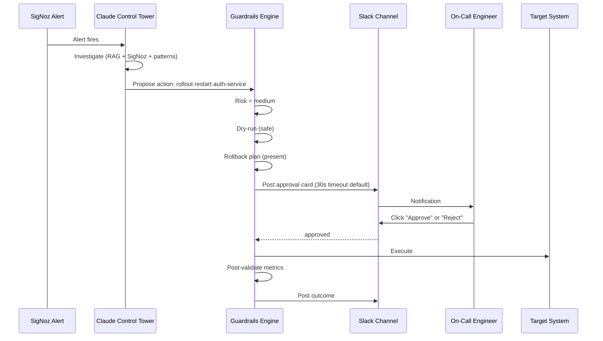

# AI SRE Agent That Watches Before It Acts — The 4-Stage Automation Ladder

*How I stopped being scared of giving an AI agent production access — by making it prove itself for a month first.*

---

## Don't let an AI agent touch production on day one

I've watched a lot of teams do this wrong. A shiny new AI ops tool shows up, someone wires it to `kubectl` with cluster-admin, and two weeks later there's a postmortem titled "Why the bot scaled payment-service to zero at 2 AM."

After that incident, nobody trusts the bot again. The tool gets shelved. The team goes back to pager rotation and 40-page runbooks. The vendor loses the account.

The problem isn't the AI. The problem is that we gave it full production access before it earned the trust.

I'm building [Aegis](https://github.com/JIUNG9/aegis), an AI-native DevSecOps command center, on nights and weekends. The whole point is that the AI investigates incidents, proposes fixes, and — eventually — executes low-risk ones autonomously. But "eventually" is the key word.

Here's the trust-building ladder I designed into Aegis v4.0, and the slow arc I used on my own team at Placen (a NAVER subsidiary) to get from "AI watches only" to "AI acts on low-risk."

> **The rule**: An AI agent should earn each rung of autonomy. Skipping rungs is how you end up in a postmortem.

---

## The fear every ops team has

Every SRE I've talked to about AI agents has the same two-part anxiety:

**Part 1:** "What if the AI hallucinates a fix and breaks production?"

**Part 2:** "What if my team finds out I let the AI touch production and loses trust in me?"

The second fear is bigger than the first. In Korean SRE culture — and honestly in any SRE culture — you don't get forgiven for letting an automated system break production. You get forgiven for humans making mistakes because the humans can explain themselves in a postmortem. An AI agent can't defend itself. It just sits there in the audit log, implicating you.

So the question isn't "is the AI good enough?" The question is "how do I structure this so that when the AI is wrong, the blast radius is contained and the audit trail is clean?"

That's what the automation ladder is for.

---

## Conf42 SRE 2026: safety-first as industry pattern

I sat in on a bunch of Conf42 SRE 2026 talks earlier this year and noticed a pattern. Every team doing AI ops at scale — not just demos, but in production — had essentially the same four-stage rollout:

1. **Shadow mode** — AI runs in parallel to humans, never takes action.
2. **Recommendation mode** — AI surfaces suggestions, humans decide.
3. **Selective automation** — AI auto-acts on clearly safe things.
4. **Bounded autonomy** — AI auto-acts on most things, humans approve the scary ones.

This isn't new. It's the same pattern autonomous driving uses (SAE Levels 0–5). It's the same pattern Google's auto-remediation playbook uses. It's the same pattern any sane safety engineer would design.

The mistake people make is trying to skip to stage 3 on day one because "we already tested it in staging."

> **Staging is not production.** No amount of synthetic load testing prepares you for the emergent weirdness of real traffic at 3 AM on a Saturday.

The automation ladder is just an acknowledgment that trust is earned on a schedule measured in weeks, not hours.

---

## The 4 stages, in detail

Here's how I structured it in Aegis. This maps directly to the `observation_mode.py` module I'm building in the `guardrails/` engine (coming in Layer 4 — see [ARCHITECTURE.md](https://github.com/JIUNG9/aegis/blob/main/ARCHITECTURE.md) for the roadmap).

### Stage 1: OBSERVE

**What it does:** AI watches every alert, runs its investigation, generates a root-cause hypothesis, and logs everything. Nothing is shown to the operator. Nothing is acted on.

**Why start here:** You need a baseline. For two weeks, you let the AI run in complete silence, then you compare its conclusions to what humans actually did. How often was the AI right? Where did it confidently suggest something stupid? Which services does it understand well, and which does it guess on?

**Exit criteria:** When the AI's silent conclusions match human resolutions ~70% of the time on your common incident types.

### Stage 2: RECOMMEND

**What it does:** AI's investigation and proposed fixes appear in the Slack channel and on the incident dashboard. But the "execute" buttons are disabled. Humans read the recommendation, decide on their own, and act.

**Why this stage matters:** This is where the team starts *using* the AI as an augmentation. The on-call engineer gets paged, opens Slack, and sees "Aegis analysis: this looks like the connection-pool exhaustion pattern from three weeks ago; recommend rolling restart of `auth-service`; rollback plan attached." The engineer doesn't have to trust the AI — they can read the reasoning, check the metrics it cited, and decide.

You'd be surprised how long this stage should last. I kept Aegis in Stage 2 for a full month at Placen before considering Stage 3. The first two weeks were mostly me reading recommendations during ambient hours and grading them. By week four, the team was asking "where's the Aegis summary?" when they got paged before looking at Grafana.

**Exit criteria:** Team actively uses the recommendations, and you have data showing the AI's suggestions would have been safe (no "good thing we didn't let it do that" moments).

### Stage 3: LOW-AUTO

**What it does:** AI auto-executes low-risk actions (read-only queries, scale-up for traffic spikes, cache flushes on specific services). Medium and high-risk actions still go through human approval.

**Why low-only first:** Low-risk actions are reversible and observable. If the AI scales `checkout-service` from 5 to 8 replicas at 10 AM during a traffic spike, the worst case is "it scaled when it didn't need to" — which costs you pennies and nothing else. That's a cheap way to prove the execution path itself works end-to-end.

This is the stage I'm currently at with my internal instance, 10 weeks in. And I'm deliberately staying here for another two months before moving up.

**Exit criteria:** 100+ successful auto-executions with zero rollbacks triggered by post-validation.

### Stage 4: FULL-AUTO

**What it does:** AI auto-executes low and medium-risk actions. High-risk actions still require manual approval. Blocked actions (IAM changes, resource deletion, `terraform apply`) are never automated.

**What this actually looks like:** The AI can now restart pods, scale deployments, roll back recent releases, flush caches, and update non-prod config — all without waking you up. You see the audit log in the morning and confirm. High-risk stuff (multi-service changes, data migrations, anything touching production IAM) still requires you to type approve in Slack.

I won't be at Stage 4 for another six months minimum.

> **Stage 4 is not the end state for everything.** Some actions should never be automated, no matter how much the AI earns your trust. IAM changes are one. Data deletion is another. Those stay at "blocked" forever.

---

## Risk classification — the table that decides what the AI can touch

Every proposed action gets classified by the `risk_assessor.py` module (planned — see [Layer 4 spec](https://github.com/JIUNG9/aegis/blob/main/ARCHITECTURE.md#layer-4-production-guardrails)). The classification drives everything downstream: dry-run, approval gates, rollback requirements, audit verbosity.

| Action | Risk | Stage 1 | Stage 2 | Stage 3 | Stage 4 |
|---|---|---|---|---|---|
| `query_logs`, `query_metrics`, `describe_pod` | Read-only | auto | auto | auto | auto |
| Update staging env var | Low | observe | recommend | auto | auto |
| `kubectl scale --replicas=N` (up) | Low | observe | recommend | auto | auto |
| Cache flush (single service) | Low | observe | recommend | auto | auto |
| `kubectl rollout restart deployment/X` | Medium | observe | recommend | recommend | auto |
| `kubectl rollout undo` | Medium | observe | recommend | recommend | auto |
| Scale-down prod deployment | Medium | observe | recommend | recommend | auto |
| Update prod config (non-secret) | Medium | observe | recommend | recommend | auto |
| `terraform apply` (any) | High | observe | recommend | recommend | approval |
| Multi-service rollback | High | observe | recommend | recommend | approval |
| `kubectl delete` anything | High | observe | recommend | recommend | approval |
| IAM role / policy change | Blocked | never | never | never | never |
| Data mutation / deletion | Blocked | never | never | never | never |

The classifier isn't a free-form LLM call. It's a rule engine with LLM fallback. The rules cover 90% of actions (regex on commands, service tags, namespace). The LLM only adjudicates ambiguous ones, and it has to justify its classification in the audit log.

> **Why regex first, LLM second:** I don't want a hallucinated risk score. For anything that matches a rule, the AI's risk opinion doesn't matter. The rule wins.

---

## Pre-validation: dry-run before you commit

Before any action at Stage 3 or 4 actually runs, it goes through `pre_validator.py` (planned at [apps/ai-engine/guardrails/pre_validator.py](https://github.com/JIUNG9/aegis/blob/main/apps/ai-engine/guardrails)). This is not the same as the LLM reasoning about whether the action is safe. This is a mechanical check.

```python
# Pseudocode from the planned pre_validator
async def dry_run(action: ProposedAction) -> DryRunResult:
    if action.command.startswith("kubectl"):
        # Every kubectl action must dry-run first
        result = await shell(f"{action.command} --dry-run=server")
        if result.exit_code != 0:
            return DryRunResult(safe=False, reason=result.stderr)

    if action.command.startswith("terraform"):
        # Terraform apply never executes from AI — planning only
        return DryRunResult(safe=False, reason="terraform_apply_blocked")

    if action.target_namespace in PROTECTED_NAMESPACES:
        return DryRunResult(safe=False, reason="protected_namespace")

    return DryRunResult(safe=True, plan=result.stdout)
```

The dry-run output gets stored with the audit entry. If the AI later claims "I scaled auth-service," there's a paired record of what the server said the action *would* do before it happened. That's how you debug the AI being wrong about its own actions.

---

## Post-validation: did the metrics actually improve?

This is the part most AI ops tools skip, and it's the part that matters most at 3 AM. After an action executes, the AI has to prove it worked — not by the AI's own judgment, but by measurable change in SigNoz metrics.

The `post_validator.py` module (planned) does this:

```python
async def verify_action(action: ExecutedAction) -> VerificationResult:
    # Wait for metrics to stabilize
    await asyncio.sleep(60)

    # Compare the 5-minute window before action vs. after
    metrics_before = action.metrics_snapshot
    metrics_after = await signoz.fetch_metrics(
        service=action.target_service,
        window_minutes=5,
    )

    # Did the target metric actually improve?
    improvement = compare(metrics_before, metrics_after, action.target_metric)

    if improvement < action.expected_improvement * 0.5:
        # Not enough improvement — roll back
        await rollback_manager.execute(action.rollback_plan)
        return VerificationResult(success=False, rolled_back=True)

    return VerificationResult(success=True, improvement=improvement)
```

Rollback-first is the core discipline. Every action must come with a rollback plan before it's allowed to execute. The `rollback_manager.py` (planned) refuses to run any action where `action.rollback_plan` is `None`. That's non-negotiable.

> **If the AI can't articulate how to undo it, the AI can't do it.** This rule alone filters out 80% of the worst mistakes before they happen.

---

## Approval gates: Slack for the uncertain middle

Medium-risk actions go through `approval_gate.py` (planned). The flow:



The Slack card has four buttons: **Approve**, **Reject**, **Modify**, **Escalate**. The on-call engineer sees the full context — the alert, the investigation, the proposed command, the dry-run output, the rollback plan, the historical success rate of similar actions.

The important detail: **no auto-approve on timeout**. If nobody answers in 30 seconds, the action does not proceed. I've seen tools default to "no response = approved" and it's the single most dangerous default I can think of.

---

## Audit trail: SOC2-compliant decision log

Every AI decision — every single one, including the ones that got rejected at the guardrails stage — goes into the audit log via `audit_logger.py` (planned at [apps/ai-engine/guardrails/audit_logger.py](https://github.com/JIUNG9/aegis/blob/main/apps/ai-engine/guardrails)).

A real log entry looks like this:

```json
{
  "timestamp": "2026-04-19T10:30:00Z",
  "investigation_id": "INV-2026-042",
  "trigger": "signoz_alert:auth-service-error-rate-high",
  "automation_stage": 3,
  "proposed_action": {
    "command": "kubectl rollout restart deployment/auth-service -n prod",
    "target_service": "auth-service",
    "expected_improvement": "error_rate < 1%"
  },
  "risk_classification": {
    "level": "medium",
    "classifier": "rule_engine",
    "rule": "kubectl_rollout_restart_prod"
  },
  "pre_validation": {
    "dry_run_exit_code": 0,
    "dry_run_output": "deployment.apps/auth-service restarted (dry run)"
  },
  "rollback_plan": {
    "present": true,
    "command": "kubectl rollout undo deployment/auth-service -n prod",
    "to_revision": 47
  },
  "approval": {
    "gate": "slack",
    "approver": "junegu",
    "approved_at": "2026-04-19T10:30:47Z",
    "decision_latency_seconds": 47
  },
  "execution": {
    "started_at": "2026-04-19T10:30:47Z",
    "completed_at": "2026-04-19T10:31:03Z",
    "exit_code": 0
  },
  "post_validation": {
    "window_minutes": 5,
    "metrics_before": {"error_rate_pct": 5.2, "p99_latency_ms": 1200},
    "metrics_after": {"error_rate_pct": 0.3, "p99_latency_ms": 280},
    "success": true
  },
  "model": "claude-sonnet-4-6",
  "tokens": {"input": 8420, "output": 3980},
  "cost_usd": 0.08
}
```

This log is append-only, signed, and exportable to any SOC2 auditor. When somebody asks "did the AI do anything weird last quarter?" — here's your answer, structured, timestamped, with evidence.

---

## The real story: the slow arc

Here's the honest timeline of how this actually went on my team.

**Week 1–2 — Stage 1 (OBSERVE).** I wired Aegis up to our staging SigNoz instance and let it run silent. At the end of week two, I had a spreadsheet of 47 alerts the AI had analyzed. It was dead-right on 34, wrong-but-not-dangerous on 9, confidently wrong on 4. The 4 confident-wrongs were all on one service I knew had sparse documentation. Lesson: the AI is as good as the runbooks it has to read.

**Week 3–6 — Stage 2 (RECOMMEND).** I flipped on the Slack integration so the team could see recommendations on every alert. I didn't announce it. The first week, nobody commented. Week two, one of my peers said, "Hey, the Aegis summary saved me 10 minutes on that database alert." Week three, a second engineer started quoting Aegis in the incident channel. By week six, the team was asking "what does Aegis think?" before opening their own Grafana tabs.

**Week 7 — The "thank god it didn't act" moment.** Aegis recommended restarting the user-service pods during what turned out to be an upstream Keycloak degradation. The pods were fine; the problem was that Keycloak was slow. If we'd been at Stage 3 for medium-risk actions, the AI would have restarted perfectly healthy pods while the real issue got worse. That moment bought me another six weeks of Stage 2 before I dared touch Stage 3.

**Week 10 — Stage 3 (LOW-AUTO), low-risk only.** I enabled auto-execution for exactly four action types: scale-up during confirmed traffic spikes, single-service cache flush, specific HPA-override reverts, and staging env var updates. Every other action type stays at recommend. Ten weeks in at Stage 3 as of writing, and I'm planning to stay here for another two months.

**The takeaway:** If I'd skipped to Stage 3 on day one, I'd have restarted healthy pods during the Keycloak incident, eaten a postmortem, and lost the team's trust permanently. The ladder saved me from my own optimism.

> **The cost of going slow is some extra human toil for a few weeks. The cost of going fast is a production incident and a project that never recovers credibility.**

---

## Code you can read now

Aegis v4.0 is OSS. The guardrails engine is in-progress as Layer 4 of the architecture. Here are the roadmap files:

- [`apps/ai-engine/guardrails/engine.py`](https://github.com/JIUNG9/aegis/blob/main/apps/ai-engine/guardrails) — main guardrails orchestrator (planned)
- [`apps/ai-engine/guardrails/risk_assessor.py`](https://github.com/JIUNG9/aegis/blob/main/apps/ai-engine/guardrails) — rule-based + LLM-fallback classifier (planned)
- [`apps/ai-engine/guardrails/observation_mode.py`](https://github.com/JIUNG9/aegis/blob/main/apps/ai-engine/guardrails) — automation ladder state machine (planned)
- [`apps/ai-engine/guardrails/approval_gate.py`](https://github.com/JIUNG9/aegis/blob/main/apps/ai-engine/guardrails) — Slack + manual approval integration (planned)
- [`apps/ai-engine/guardrails/pre_validator.py`](https://github.com/JIUNG9/aegis/blob/main/apps/ai-engine/guardrails) — dry-run + input validation (planned)
- [`apps/ai-engine/guardrails/post_validator.py`](https://github.com/JIUNG9/aegis/blob/main/apps/ai-engine/guardrails) — metrics-based verification (planned)
- [`apps/ai-engine/guardrails/rollback_manager.py`](https://github.com/JIUNG9/aegis/blob/main/apps/ai-engine/guardrails) — rollback plan enforcement (planned)
- [`apps/ai-engine/guardrails/audit_logger.py`](https://github.com/JIUNG9/aegis/blob/main/apps/ai-engine/guardrails) — SOC2-compliant decision log (planned)

The existing orchestrator at [`apps/ai-engine/agents/orchestrator.py`](https://github.com/JIUNG9/aegis/blob/main/apps/ai-engine/agents/orchestrator.py) already has the state machine (`InvestigationState.PROPOSE_REMEDIATION` → `AWAIT_APPROVAL`). Layer 4 wires the guardrails engine between those two states.

---

## Try it yourself

Clone Aegis and run the dashboard locally:

```bash
git clone https://github.com/JIUNG9/aegis
cd aegis
pnpm install
pnpm dev
```

Open the AI settings page at `/settings/ai-tokens` and you'll see the **Safety & Guardrails** section with the automation ladder selector (currently defaulting to Stage 2 — Recommend). That selector will wire into the real `observation_mode.py` state machine as Layer 4 lands.

If you're doing anything similar on your team, I'd love to hear what stages you've landed at and what surprised you. Reply to this post, or file an issue on [github.com/JIUNG9/aegis](https://github.com/JIUNG9/aegis) with your automation war stories.

---

## Next article

I'm writing about how the Claude API + MCP stack replaced my 3 AM pager — for about $15/month. That's the flip-side of this article. Guardrails are the "no" half of the automation story. The Control Tower is the "yes" half: the actual investigation flow that makes the AI worth having around in the first place.

Read it here: [How Claude API + MCP Replaced Our 3 AM Pager — For $15/month](https://github.com/JIUNG9/aegis/tree/main/articles/05-claude-mcp-pager).

---

*June Gu is an SRE at Placen (a NAVER subsidiary) in Seoul, ex-Coupang. He's building [Aegis](https://github.com/JIUNG9/aegis) — an open-source AI-native DevSecOps command center — on evenings and weekends. He's relocating to Canada in February 2027 and is open to SRE and DevOps roles in the Toronto area.*

**Tags:** AI, SRE, DevOps, Automation, Safety
