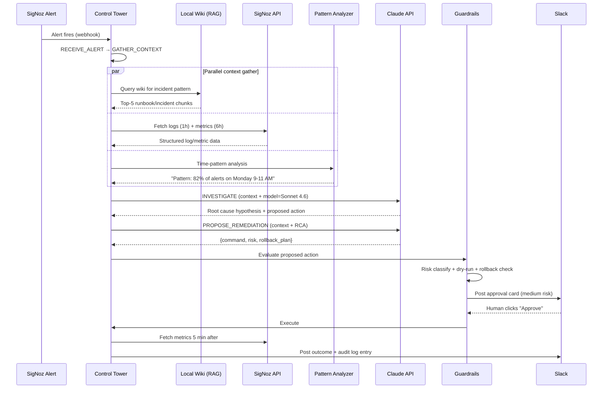

# How Claude API + MCP Replaced Our 3 AM Pager — For $15/month

*The AI investigates the incident, reads the wiki, checks SigNoz metrics, and proposes a fix before I open my laptop.*

---

## The page that doesn't wake me up anymore

It's 3:07 AM. My phone buzzes. Alert: `auth-service error_rate > 5% for 3 minutes`.

Six months ago, this is where the 45-minute scramble started. Log in to the VPN. Find the right Grafana dashboard. Guess which service version is deployed right now. Open three Confluence tabs, none of which are the runbook I actually want. Type `kubectl get pods -n prod` and try to remember what "CrashLoopBackOff" actually meant at this hour.

Tonight is different. I open Slack with one eye closed. There's already a thread:

> **Aegis** — Alert: `auth-service error_rate 6.1%` (threshold 5%)
>
> **Investigation** — This matches the connection-pool exhaustion pattern from the `auth-service` wiki page. 82% of similar alerts in the last 90 days were caused by DB connection saturation after Monday morning traffic ramp. Current p99 latency is 1,240ms (baseline 180ms). Pod count: 6. DB `auth_db` active connections: 98/100.
>
> **Recommended action** — `kubectl rollout restart deployment/auth-service -n prod` (risk: medium · dry-run: safe · rollback: `kubectl rollout undo ... --to-revision=47`)
>
> **Approve** · **Reject** · **Modify** · **Escalate**

I type "approve" in Slack. Two minutes later, the second Aegis message:

> **Post-validation** — error_rate 0.3% (was 6.1%) · p99 240ms (was 1,240ms) · rollback not triggered · INV-2026-117 closed.

I go back to sleep at 3:11.

This article is about the Control Tower that makes this possible — Layer 3 of [Aegis v4.0](https://github.com/JIUNG9/aegis), the open-source AI-native DevSecOps command center I'm building. It costs about $15/month to run at my volume. Let me show you how.

---

## Why traditional runbooks fail at 3 AM

The dirty secret of SRE culture is that our runbooks are written for the version of us that's awake, caffeinated, and at a full desk setup. They don't work for the version of us that was asleep eight seconds ago.

Here's what's broken about traditional runbooks:

1. **They're too long.** A good auth-service runbook at Placen (a NAVER subsidiary) is 12 pages of markdown. At 3 AM, I'm not reading 12 pages. I'm scrolling past 11 of them to find the one paragraph that applies.
2. **They assume you remember context.** "Check the usual DB metrics." Which usual metrics? Which DB? The version I set up in Terraform six months ago, or the one from after the PG 13→16 migration?
3. **They don't cross-reference recent incidents.** The last three times this exact alert fired, the cause was the same. The runbook doesn't know that. A human had to notice the pattern.
4. **They're stale.** The runbook was last touched nine months ago. The service has deployed 40 times since then.

> **The AI isn't replacing the runbook. The AI is the thing that reads the runbook for you at 3 AM, cross-references it with the last 90 days of SigNoz data, and hands you a specific action.**

This is what Claude API was designed for, once you wire it up right. Which is what the Control Tower is.

---

## Enter the Claude Control Tower

The Control Tower is the existing LangGraph-based orchestrator at [`apps/ai-engine/agents/orchestrator.py`](https://github.com/JIUNG9/aegis/blob/main/apps/ai-engine/agents/orchestrator.py), extended in v4.0 with RAG context, real SigNoz data, time-pattern analysis, and guardrails hooks.

The base orchestrator today already runs a state machine:

```python
class InvestigationState(str, Enum):
    RECEIVE_ALERT = "receive_alert"
    GATHER_CONTEXT = "gather_context"
    INVESTIGATE = "investigate"
    GENERATE_RCA = "generate_rca"
    PROPOSE_REMEDIATION = "propose_remediation"
    AWAIT_APPROVAL = "await_approval"
    COMPLETED = "completed"
    FAILED = "failed"
```

Each state uses Claude with a specific system prompt tailored to that phase. The `GATHER_CONTEXT` prompt is triage-focused; the `INVESTIGATE` prompt is deep-analysis-focused; the `PROPOSE_REMEDIATION` prompt has to output structured JSON with risk levels and rollback plans.

Layer 3 v4.0 adds a new `investigate_with_context()` method that sits between `GATHER_CONTEXT` and `INVESTIGATE`. It's the glue that binds three context sources to the model:

```python
# From the Layer 3 spec — coming to apps/ai-engine/agents/orchestrator.py
async def investigate_with_context(self, incident):
    # 1. Get wiki / RAG context (relevant runbooks, past incidents)
    rag_chunks = await self.retriever.query(incident.description, top_k=5)

    # 2. Get SigNoz real-time data
    logs = await self.signoz.fetch_logs(incident.service, hours=1)
    metrics = await self.signoz.fetch_metrics(incident.service, hours=6)
    patterns = await self.pattern_analyzer.analyze(incident.service)

    # 3. Build enriched context
    context = {
        "runbook_context": rag_chunks,
        "recent_logs": logs[:50],
        "metrics_summary": metrics,
        "time_patterns": patterns,
        "incident": incident.dict(),
    }

    # 4. Claude investigates with full context
    result = await self.claude_investigate(context)

    # 5. Guardrails check before any action (Layer 4)
    if result.proposed_actions:
        result = await self.guardrails.evaluate(result)

    return result
```

The key design decision: the LLM never fetches its own observability data via generic tool-calling. That's too slow and too loose. The orchestrator fetches the data *before* the LLM call and stuffs it into the system prompt as structured context. The LLM's job is reasoning, not scraping.

> **The LLM is not a database client. It's a reasoning engine with one expensive round-trip per investigation. Do the I/O separately, stuff the results into context, and let the LLM think.**

---

## The investigation flow end-to-end

Here's the full lifecycle of a real alert.



The whole loop runs in 60–120 seconds from alert-fire to Slack-card. The slowest part is the LLM round-trip (typically 8–20 seconds on Sonnet). Fetching SigNoz data in parallel with the wiki query keeps the context-gather phase under 2 seconds.

---

## Model routing: Eco / Standard / Deep

Claude has three model tiers that map naturally to investigation complexity. The AI settings page in Aegis exposes them as **Eco**, **Standard**, and **Deep**.

- **Eco** — Haiku. Wiki synthesis, simple log summaries, routing decisions. ~$0.001 per investigation.
- **Standard** — Sonnet 4.6. Incident investigation, pattern analysis, remediation proposal. ~$0.08 per investigation.
- **Deep** — Opus. Multi-service correlation, complex RCAs, novel failure modes. ~$0.25 per investigation.

The routing logic lives in the token tracker (`services/token_tracker.py` in the existing codebase). It's not a black-box heuristic — it's a decision table:

```python
# Simplified routing rule
def choose_model(incident: Incident) -> str:
    if incident.complexity == "simple_status_check":
        return "claude-haiku-4-5"
    if incident.services_affected > 2:
        return "claude-opus-4-7"
    if incident.severity == "critical":
        return "claude-opus-4-7"
    return "claude-sonnet-4-6"  # Default
```

About 50% of alerts at my volume route to Eco (they're traffic-pattern questions or simple status checks, not real incidents). About 40% go to Standard (the real investigations). About 10% go to Deep (multi-service problems or anything involving the data plane).

The math on that mix:

- 200 investigations/month
- 100 × $0.001 (Eco) = $0.10
- 80 × $0.08 (Standard) = $6.40
- 20 × $0.25 (Deep) = $5.00
- Plus wiki synthesis and overhead: ~$3/mo
- **Total: ~$14.50/month**

Which is cheaper than one SaaS vendor's "AI incident management" starter tier (I checked — they start at $49/seat/month). And you own the whole stack.

> **$15/month for the AI part is only possible because I own the context pipeline. If I were paying per-query to a vendor-hosted RAG service, I'd be paying $200+ for the same thing.**

---

## Token budget management

The fun failure mode of any AI ops system is: somebody writes a bad prompt chain, it loops, and the next morning you have a $400 bill.

The Aegis token tracker enforces a monthly cap and an auto-downgrade rule. If I set my cap at $30 and I'm at $26 with a week left, the model router starts downgrading Standard→Eco and Deep→Standard for non-critical alerts. You see a "BUDGET_THROTTLED" badge in the UI.

The cap and the downgrade rules are configurable in the AI settings page. The defaults are:

- **Soft cap (80% of budget)** — warn on the dashboard, keep current routing.
- **Hard cap (100% of budget)** — downgrade Deep → Standard, Standard → Eco, except for incidents tagged `critical` by the alert rule.
- **Emergency override** — type a reason in Slack, the next investigation runs at requested tier regardless of cap.

This is the kind of guardrail that only matters when it matters. I've hit the soft cap exactly once (and it was because I was testing a new pattern-analyzer that was chatty). But having it there means I can run this in the background and never worry about a runaway cost spike.

The other thing the token tracker does is per-investigation accounting. Each run records input tokens, output tokens, cache-read tokens, cache-write tokens, and cost. That per-run data is what drives the monthly cost chart on the dashboard and the model-routing effectiveness graphs. If I see Deep-tier investigations trending up week-over-week, that's a signal — either the incidents are getting harder, or my routing heuristics are too conservative and I should tighten the Deep-tier trigger.

Prompt caching is the other lever. Aegis caches the static parts of every investigation prompt: the system instructions, the MCP tool catalog, the standing context about our services and SLOs. Only the incident-specific context and the wiki chunks change per run. On a typical Sonnet investigation, that means ~6,000 of the 8,500 input tokens are cache hits at ~10% of the normal cost, which knocks another 30–40% off the bill without changing anything the LLM sees.

> **Caching is the unsexy optimization that actually moves the needle on cost.** If you're not caching your system prompt and tool catalog across runs, you're overpaying by 30–50%.

---

## MCP — how tools get wired to Claude

Model Context Protocol (MCP) is Anthropic's standard for giving Claude safe, audited access to external tools. Aegis already has the MCP server scaffolded at [`apps/ai-engine/mcp/server.py`](https://github.com/JIUNG9/aegis/blob/main/apps/ai-engine/mcp/server.py), with three tool categories today:

- [`mcp/tools/infrastructure.py`](https://github.com/JIUNG9/aegis/blob/main/apps/ai-engine/mcp/tools/infrastructure.py) — k8s describe, pod logs, deployment status
- [`mcp/tools/observability.py`](https://github.com/JIUNG9/aegis/blob/main/apps/ai-engine/mcp/tools/observability.py) — SigNoz log / metric / trace queries
- [`mcp/tools/workflow.py`](https://github.com/JIUNG9/aegis/blob/main/apps/ai-engine/mcp/tools/workflow.py) — incident state transitions

Layer 5 adds a fourth: [`mcp/tools/docs_reconciliation.py`](https://github.com/JIUNG9/aegis/blob/main/apps/ai-engine/mcp/tools) (planned) — Confluence sync, GitHub docs scan, incident-history sync, and docs-lint. This is what keeps the wiki fresh so the Control Tower has current context at 3 AM.

Each MCP tool has three metadata flags that the Control Tower respects:

```python
@mcp_tool(
    name="kubectl_rollout_restart",
    category="WRITE",          # READ | WRITE | BLOCKED
    risk_default="medium",     # default risk classification
    requires_approval=True,    # always ask Slack, even at stage 4
)
async def kubectl_rollout_restart(service: str, namespace: str) -> dict:
    ...
```

The category flag is the big one:

- **READ** tools are always safe. The AI can call them freely (`query_logs`, `describe_pod`, `fetch_metrics`).
- **WRITE** tools require Slack approval (at my stage) or auto-approval within the automation ladder's current stage (see [Article 4](../04-automation-ladder/article.md)).
- **BLOCKED** tools are never automated. IAM changes, resource deletion, anything touching the data plane.

This separation is load-bearing. The LLM can't silently promote a READ tool to a WRITE action. The MCP layer enforces category at the protocol level.

Each tool call is logged with the request args, the response, and a latency measurement. That log is both a debugging aid and an audit artifact: six months from now, when somebody asks "did the AI ever call this specific tool against that namespace?", I have a grep-able answer. The MCP server also exposes a `/tools/usage` endpoint that surfaces the top-called tools per week — useful for understanding what the AI actually does day-to-day versus what I assumed it would do.

One pattern I'm watching carefully: the AI has a tendency to over-fetch when a READ tool is free. Ten calls to `query_logs` with slightly different filters is a failure mode, not a feature. I've added a per-investigation budget of "no more than 5 tool calls of the same category" at the MCP layer, and the LLM gets a hint in its system prompt that excessive tool-calling will get the investigation downgraded. Soft pressure, mostly effective.

---

## Before and after: the investigation time budget

Here's the real change from the before-Aegis to the after-Aegis workflow.

- **Alert fires → on-call acknowledges** — 30 sec before, 30 sec after.
- **Find the right runbook** — 3–8 min before. 0 sec after (wiki context in Slack).
- **Pull SigNoz logs + metrics** — 4–10 min before. 0 sec after (pre-fetched in context).
- **Correlate with recent incidents** — 5–15 min before. 0 sec after (pattern analyzer did it).
- **Form a hypothesis** — 2–5 min before. 0 sec after (in Slack card).
- **Decide on an action** — 1–3 min before. 15–45 sec after (read card, click).
- **Execute** — 1–2 min before. 30–90 sec after (auto or Slack-approved).
- **Verify fix worked** — 3–5 min before. Auto after (post-validator, 60 sec).
- **Total p50** — **~20 min** before. **~2 min** after.
- **Total p95 (harder incidents)** — **~45 min** before. **~5 min** after.

The Control Tower doesn't *solve* the incident faster than a senior SRE can. What it does is eliminate the 18 minutes of ambient toil per alert that come from context-gathering and tab-switching. Compounded over a week, that's hours back.

> **Before Aegis: 30 min average investigation. After Aegis: AI has context and proposal in 90 seconds. I'm still the one deciding — I'm just deciding faster, with more data, and less coffee.**

---

## Rollback-first discipline

The Control Tower's `PROPOSE_REMEDIATION` prompt has a hard requirement: every proposed action must include a rollback plan. The prompt literally says:

> For each remediation step, provide: description, command, risk_level, requires_approval, estimated_impact, category. Respond with a JSON object containing remediation_steps and a **rollback_plan** field that is a concrete shell command, not prose.

If the LLM returns an action without a rollback plan, the orchestrator rejects it and retries the prompt. If it fails twice, the investigation goes to `FAILED` state with reason `no_rollback_plan`. This is a structural guarantee, not a suggestion.

Layer 4 (Guardrails — covered in [Article 4](../04-automation-ladder/article.md)) enforces this at the execution gate too: no rollback plan, no execution. The two layers double up because rollback-first is too important to trust to just one check.

---

## Try it yourself

```bash
git clone https://github.com/JIUNG9/aegis
cd aegis
pnpm install
pnpm dev
```

Once the dashboard is up at `http://localhost:3000`, go to **Settings → AI & Tokens**. You'll see:

- The three-tier model selector (Eco / Standard / Deep) with per-investigation cost estimates.
- The monthly token budget with a soft-cap / hard-cap threshold.
- The RAG/wiki knowledge base section (Layer 1, Ollama + ChromaDB default — $0/mo).
- The Safety & Guardrails section (Layer 4 scaffolding — Automation Ladder selector).

The MCP server starts on port 8001 by default. You can hit `http://localhost:8001/tools` to see the registered tool catalog and their READ/WRITE/BLOCKED flags.

If you want to test an investigation end-to-end without a real SigNoz instance, there's a mock SigNoz fixture in [`apps/ai-engine/tests/fixtures/`](https://github.com/JIUNG9/aegis/tree/main/apps/ai-engine/tests) (part of the Layer 2 work).

---

## Next article

The next piece in this series is about the specific patterns that SigNoz reveals once you feed it to an LLM. The one I'm leading with: **80% of our incidents happen Monday 9–11 AM**. That's the kind of insight that would never come out of a dashboard — you need a pattern analyzer to surface it, and you need an AI to pre-position runbooks around it.

Read it here: [We Found That 80% of Our Incidents Happen on Monday 9 AM](https://github.com/JIUNG9/aegis/tree/main/articles/06-monday-9am-patterns).

---

## Cost summary (for the skeptics)

Let me show the full math one more time, because "$15/month" sounds suspicious until you see the breakdown.

**Monthly recurring:**
- Claude API (Haiku + Sonnet + Opus, mix as described): ~$14.50
- Ollama embeddings (local, free): $0
- ChromaDB (local, free): $0
- SigNoz HTTP API (you already pay for this): $0 incremental
- GitHub Actions for wiki auto-publish: free tier
- **Total: ~$15/month**

**Not included (because it's already in your stack):**
- The SigNoz ClickHouse backend (your observability bill).
- The Kubernetes cluster (your platform bill).
- The developer time to set it up (~2 weekends).

**What you don't pay:**
- Per-seat SaaS AI ops tool licensing ($49–$199/seat/month at current market rates).
- Cloud embedding API fees ($30–$100/month at my document volume).
- Vector database hosting fees ($20–$70/month on Pinecone/Qdrant Cloud).

The short version: if you already own your observability stack, adding an AI Control Tower on top of it is a $15/month incremental cost. That's the real unlock.

---

*June Gu is an SRE at Placen (a NAVER subsidiary) in Seoul, ex-Coupang. He's building [Aegis](https://github.com/JIUNG9/aegis) — an open-source AI-native DevSecOps command center — on evenings and weekends. He's relocating to Canada in February 2027 and is open to SRE and DevOps roles in the Toronto area.*

**Tags:** AI, Claude API, MCP, Incident Management, SRE
