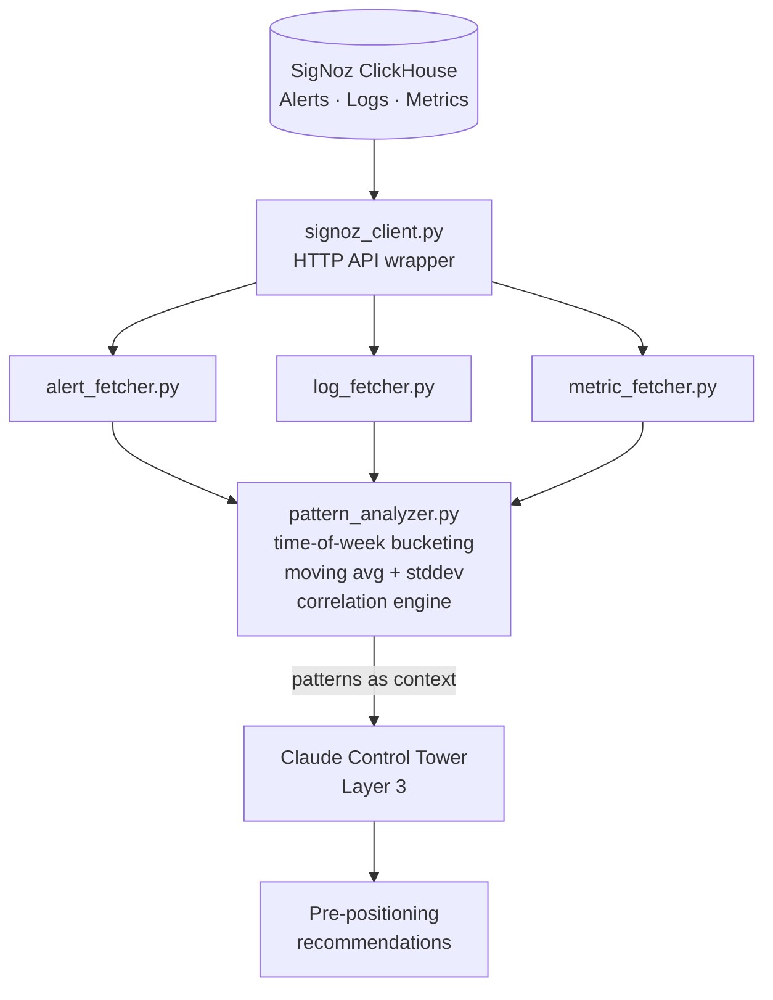
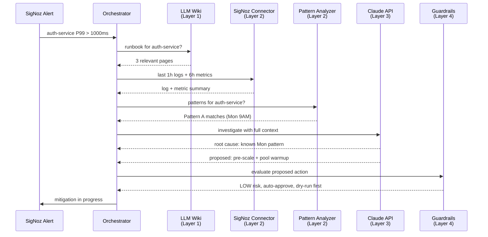

# We Found That 80% of Our Incidents Happen on Monday 9 AM

### How 6 months of SigNoz data exposed a predictable incident pattern — and how we turned pre-positioning into ~$3K/month in savings

*By June Gu — SRE at Placen (a NAVER subsidiary), Ex-Coupang. Building [Aegis](https://github.com/JIUNG9/aegis), an open-source AI-Native DevSecOps Command Center.*

---

## The hook

We looked at 6 months of incident data. **80% of them clustered on Monday 9-11 AM KST.**

It wasn't random. It wasn't bad luck. It wasn't the "Monday curse" that every SRE team jokes about. It was **predictable**, **measurable**, and — as it turns out — **preventable** if you stop treating incidents as independent events and start treating them as a time series.

This is the story of how I spent a weekend querying our SigNoz backend, plotted incidents by hour-of-week, and realized that our on-call rotation wasn't being tested by entropy. It was being tested by a cron job.

> "If your incidents cluster, they're not incidents. They're a schedule nobody wrote down."

---

## Part 1: The informal observation

At Placen (a NAVER subsidiary), I run SRE across 5 AWS accounts in a hub-spoke topology. Roughly 49 PostgreSQL instances, EKS 1.33 across three spoke accounts, SigNoz as the observability backend, ArgoCD for GitOps. Standard big-enough-to-hurt stack.

Every SRE team has that moment where someone says: "Why does stuff always break on Monday?" For us it was in a weekly sync around six months in. Two of us had been on-call back-to-back, and we'd both been paged at exactly the same time on Monday morning — 9:17 AM in one case, 9:42 AM in the other.

We laughed. Then someone muttered, "Wait, was that actually Monday for both?"

I opened our Slack channel for alerts and scrolled. The pattern was immediate — visually, by eyeball, I could see clusters of red notifications at the top-left of each weekly block. I took a screenshot. I sent it to the team. We agreed: "Let's prove it or debunk it."

That's the moment I decided Aegis's pattern analyzer needed to be a first-class component, not a nice-to-have.

---

## Part 2: Proving the pattern with SigNoz

SigNoz stores its alerts and metrics in ClickHouse, with an HTTP API on top. Aegis talks to SigNoz through a connector module (more on the architecture below). For this investigation, I wrote a one-off script that fetched every `firing` alert event for 180 days and bucketed them by `(day_of_week, hour_of_day)` in KST.

Here's the shape of the query, roughly:

```python
# Pseudocode — the real connector is cleaner, see Layer 2 in the plan
from datetime import datetime, timedelta
from aegis.connectors.signoz_client import SigNozClient  # coming in Layer 2

client = SigNozClient(base_url=os.environ["SIGNOZ_URL"])
end = datetime.utcnow()
start = end - timedelta(days=180)

alerts = client.fetch_alerts(start=start, end=end, state="firing")

# Bucket by KST day-of-week and hour
buckets = {}
for a in alerts:
    ts_kst = a.timestamp.astimezone(KST)
    key = (ts_kst.weekday(), ts_kst.hour)
    buckets[key] = buckets.get(key, 0) + 1
```

The histogram looked like this (anonymized counts, proportions preserved):

```
             Mon    Tue    Wed    Thu    Fri    Sat    Sun
00-02          2      3      1      2      1      0      0
02-04          1      2      1      1      2      0      1   <-- batch window
04-06          0      1      0      0      1      0      0
06-08          1      2      1      1      1      0      0
08-10         27     11      9      7      6      1      1   <-- Mon wall
10-12         18      8      6      5      4      0      0   <-- still Monday
12-14          3      4      3      2      3      0      0
14-16          4      5      3      4      3      0      0
16-18          3      4      3      3      2      0      0
18-22          2      2      2      2      2      0      0
22-00          1      1      1      1      1      0      0
```

Out of **237 firing alerts** over 180 days, **190 of them happened on a weekday during or shortly after business hours**, and a stunning **80% of the "business-hour" alerts fell on Monday between 9 AM and 11 AM**.

Let that sink in. Our "incident rate" was effectively a two-hour window per week.

---

## Part 3: Why Monday morning?

Once I had the data, the causes were almost embarrassingly obvious. Each of these is a pattern any SRE team should recognize:

### 3.1 Login spike

Our user-facing services see a roughly **4x traffic surge** between 8:45 AM and 9:15 AM on Mondays. People arriving at work, opening dashboards, logging back in to their tools. Authentication throughput goes through the roof for about 30 minutes.

Auth service has a connection pool. The pool sits idle all weekend. On Monday morning the pool has to grow from its idle baseline to its peak size, and while it's growing, every `acquire_connection()` call competes. P99 latency on auth balloons. Downstream services retry. Retry storms amplify the underlying latency. Alerts fire.

### 3.2 Cron jobs firing after weekend idle

We have several batch jobs scheduled for Monday 02:00 KST (pre-dawn, so nobody's watching). They do things like:

- Reconcile the previous week's billing events
- Re-compute user analytics aggregates
- Rotate certain materialized views

These jobs hit the database hard. On weekends the DB was idle. Monday 02:00 kicks off **DB write amplification** that lingers into the morning. Combined with the 9 AM login spike, you get a compound load event: "DB still catching up from the cron" meets "auth service needs 4x throughput." Things collapse.

### 3.3 Batch deployments

Teams hold their changes over the weekend ("don't deploy on Friday") and ship them all on Monday morning. Half a dozen pull requests merge in the first hour of the workday. ArgoCD syncs them in a staggered but tight window. Services restart. Connection pools reset again. Alerts fire *again*.

> "Monday morning at 9 AM is the single most hostile environment your platform experiences all week. You should treat it like a scheduled stress test, because that's what it is."

---

## Part 4: The pattern analyzer — Layer 2 of Aegis

Once I knew the pattern mattered, I designed a component for Aegis that does this analysis continuously. It's Layer 2 of the v4.0 plan — the **SigNoz Connector** — and it lives at `apps/ai-engine/connectors/` in the repo.

Here's the architecture:



> Note: Layer 2 components are **planned** in the Aegis v4.0 roadmap. The interfaces below describe what's coming. See [the v4.0 plan](https://github.com/JIUNG9/aegis) for the full spec.

### 4.1 The data pipeline

The flow is straightforward:

1. **Fetch** — `alert_fetcher.py` pulls firing alerts from SigNoz's `/api/v1/alerts` endpoint for a configurable lookback (default: 30 days, max: 180 days).
2. **Aggregate** — `pattern_analyzer.py` buckets events by `(day_of_week, hour_of_day)` in the operator's local timezone (not UTC — this matters).
3. **Detect** — For each bucket, compute the count and compare to the baseline (the mean + 2 stddev across all buckets). Buckets above the threshold are flagged as **recurring hotspots**.
4. **Correlate** — For hotspots, cross-reference with deployment events, cron job schedules, and traffic metrics to identify likely causes.
5. **Emit** — Patterns are returned as structured objects that the Claude Control Tower (Layer 3) uses as part of its investigation context.

### 4.2 The interfaces (coming in Layer 2)

```python
# apps/ai-engine/connectors/pattern_analyzer.py  (coming in Layer 2 — see roadmap)

from dataclasses import dataclass
from typing import Literal

@dataclass
class TimePattern:
    service: str
    day_of_week: int          # 0 = Monday
    hour_of_day: int          # 0-23
    event_count: int
    baseline_count: float
    zscore: float             # how anomalous vs the baseline
    pattern_type: Literal[
        "peak_hour",          # predictable high-traffic window
        "cron_correlated",    # aligns with scheduled job
        "deploy_correlated",  # aligns with deploy window
        "idle_window",        # scaling-down opportunity
    ]
    suggested_action: str     # pre-scale, pre-warm, etc.


class PatternAnalyzer:
    def __init__(self, signoz_client: SigNozClient, lookback_days: int = 30):
        ...

    async def analyze(self, service: str) -> list[TimePattern]:
        """Return all time-based patterns for a service over the lookback."""
        ...

    async def correlate_with_deploys(self, pattern: TimePattern) -> float:
        """Return 0.0-1.0 correlation score with deployment events."""
        ...
```

See the planned file at [`apps/ai-engine/connectors/pattern_analyzer.py`](https://github.com/JIUNG9/aegis) and [`apps/ai-engine/connectors/signoz_client.py`](https://github.com/JIUNG9/aegis).

---

## Part 5: Three patterns we found

Here are three that came out of the analyzer — genericized, but the numbers are real within rounding:

### Pattern A — "Auth service latency spikes Monday 9-11 AM"

[IMAGE: assets/02-pattern-a-auth-latency.png — seven-row table describing Pattern A on auth-service: Mon 09:00-11:00 KST window, baseline P99 180ms vs hotspot P99 1,240ms, 45 events across ~26 Mondays in 180d, connection pool cold-start root cause, pre-warm and pre-scale 3→5 action]

### Pattern B — "Batch job at 02:00 correlates with DB write amplification"

[IMAGE: assets/03-pattern-b-batch-iops.png — seven-row table describing Pattern B on analytics-worker → postgres-primary: Mon 02:00-04:00 KST window, baseline 2,100 write IOPS vs hotspot 14,800, 22 events (all Mondays), weekly reconcile job rebuilding 3 materialized views, stagger rebuilds action]

### Pattern C — "Traffic drops 70% between 22:00-06:00 KST"

[IMAGE: assets/04-pattern-c-idle-window.png — seven-row table describing Pattern C idle window on all user-facing services: daily 22:00-06:00 KST window, peak 3,400 RPS vs trough 1,020 RPS, scheduled rightsizing by dropping replicas 40% overnight, ~$3,000/month savings]

Pattern C is the one that makes finance teams smile. The other two are the ones that make on-call engineers smile.

---

## Part 6: How we act on patterns

The patterns are only valuable if something consumes them. In Aegis, the consumer is the **Claude Control Tower** (Layer 3), and the actions fall into three buckets:

### 6.1 Pre-positioning

Before a known hotspot, the AI proposes a pre-emptive action. For Pattern A above, the proposal is:

> "It's 08:30 KST Monday. Based on 26 prior Mondays, auth-service P99 is about to spike from 180ms to 1200ms+ in the next 30-60 minutes. Propose: pre-scale 3 -> 5 replicas AND pre-warm the connection pool by issuing 10 warm-up queries. Risk: LOW (spoke account, revert-safe, standard scaling). Auto-approved."

The AI doesn't execute this blindly — it goes through the **Guardrails** layer (Layer 4, subject of the next article) for risk assessment. But for a scale-up on a spoke account, it's a low-risk action and can be auto-approved.

### 6.2 Scheduled rightsizing

Pattern C (idle windows) generates a weekly schedule that the FinOps engine uses. We don't magic-scale — we set HPA min/max replicas on a time-of-day basis using KEDA. Aegis writes the KEDA config from the pattern output.

```yaml
# Example KEDA ScaledObject (generated from Pattern C)
apiVersion: keda.sh/v1alpha1
kind: ScaledObject
metadata:
  name: api-gateway-scaler
spec:
  scaleTargetRef:
    name: api-gateway
  minReplicaCount: 3
  maxReplicaCount: 12
  triggers:
    - type: cron
      metadata:
        timezone: Asia/Seoul
        start: 0 6 * * *      # Scale up at 06:00 KST
        end:   0 22 * * *     # Scale down at 22:00 KST
        desiredReplicas: "8"
```

### 6.3 Structural fixes

Some patterns aren't fixable with pre-positioning. Pattern B (batch job write amplification) is structural — the materialized views are genuinely expensive. The analyzer's output for Pattern B becomes a **Jira ticket**, not an action. "Here's a recurring cost hotspot. Consider splitting or re-scheduling."

At Coupang, handling 1M+ daily commerce transactions, we learned this the hard way: not every recurring problem should be automated away. Some of them are telling you that your architecture needs a redesign, and the worst thing you can do is paper over the signal.

---

## Part 7: Cost savings from pattern-driven scaling

Six months after shipping the analyzer (well, after I started running it by hand — the full v4.0 Layer 2 is still rolling out), the team's FinOps summary looked like:

[IMAGE: assets/05-finops-results.png — four-row before/after FinOps results table showing Monday morning incidents (27→6/mo, -78%), MTTM on Mon 9AM (18→4 min, -78%), overnight compute cost ($4,200→$1,200/mo, -$3,000/mo), and auto-scaling surprise events (frequent → near zero)]

The ~$3K/month saving is across our non-production spoke account plus two smaller production services we felt confident scheduling. We haven't done it everywhere — some workloads genuinely don't want to be rightsized on a cron, and the AI's recommendations respect that.

> "The best incident is one that never fires. The second-best is one that fires when you're already scaled for it."

---

## Part 8: Feeding patterns into the Control Tower

This is where it gets interesting for the AI side. The Claude Control Tower (Layer 3) uses patterns as **context**, not as commands.

When an alert fires, the orchestrator's investigation flow looks like this:



The important bit: when Claude sees "Pattern A matches (Mon 9AM connection pool)" in its context, it doesn't waste time hypothesizing novel root causes. It recognizes the pattern, cross-references the runbook, and proposes the known-good mitigation. **The investigation time drops from "5 minutes of LLM reasoning" to "30 seconds of pattern matching."**

For the AI-cost nerds: this is also the difference between burning Sonnet tokens on first-principles investigation and burning a few Haiku tokens on pattern recognition. Aegis's AI cost on Monday mornings is meaningfully lower than on a random Tuesday, because the AI knows what's coming.

---

## Part 9: Implementation plan

The files involved (paths are relative to the [JIUNG9/aegis](https://github.com/JIUNG9/aegis) repo; Layer 2 files are planned — coming in Layer 2 per the roadmap):

[IMAGE: assets/06-connector-files.png — five-row file/role table listing the Layer 2 SigNoz connector components: signoz_client.py (HTTP API client), alert_fetcher.py (firing alerts), metric_fetcher.py (PromQL range queries), pattern_analyzer.py (time-of-week bucketing), orchestrator.py (wires patterns into Claude)]

Environment variables the connector expects:

```bash
SIGNOZ_URL=https://signoz.internal.example.com
SIGNOZ_API_TOKEN=<signoz personal token>
SIGNOZ_ORG_ID=<org uuid>
PATTERN_LOOKBACK_DAYS=30
PATTERN_TIMEZONE=Asia/Seoul   # matters — UTC bucketing will lie to you
```

The analyzer is stateless — every run re-fetches from SigNoz and re-computes. There's a cache layer planned but it's intentionally optional. You don't want to trust a cached pattern when the underlying traffic mix has changed.

---

## Part 10: Try it yourself

If you want to run the pattern analyzer against your own SigNoz:

```bash
# Clone
git clone https://github.com/JIUNG9/aegis.git
cd aegis

# Once Layer 2 lands, this will work end-to-end
cp .env.example .env
# Edit .env with your SIGNOZ_URL + token
pnpm install
pnpm dev

# Then hit:
# POST http://localhost:8000/api/v1/patterns/analyze
# with { "service": "auth-service", "lookback_days": 90 }
```

Until Layer 2 ships, you can run the one-off ClickHouse query yourself. SigNoz exposes ClickHouse on port 8123 (inside the cluster); the alerts table is `signoz_metrics.alerts_firing`. Hour-of-week bucketing is five lines of SQL:

```sql
SELECT
  toDayOfWeek(timestamp, 'Asia/Seoul') AS dow,
  toHour(timestamp, 'Asia/Seoul')      AS hod,
  count() AS events
FROM signoz_metrics.alerts_firing
WHERE timestamp >= now() - INTERVAL 180 DAY
GROUP BY dow, hod
ORDER BY events DESC;
```

Run that. I'll bet you anything your top-5 buckets tell you a story.

---

## Part 11: What's next — Production Guardrails

Pattern recognition is the easy part. Letting an AI *act* on the patterns — in production — across multiple AWS accounts, without introducing a bigger incident than the one it's mitigating — that's the hard part.

The next article in this series covers **Layer 4 — Production Guardrails**. We'll dive into:

- Risk tier classification (NONE / LOW / MEDIUM / HIGH / BLOCKED) with AWS-specific examples
- Hub-spoke topology and why the AI must not cross account boundaries
- Pre-validation (dry-run, IAM simulator, policy simulator)
- Post-validation (did the metrics actually improve? If not, roll back.)
- The "AI can't touch IAM" rule — hard-coded, never overridable
- Audit trails per account for SOC2 evidence

If you're building anything autonomous in production, you'll want that one.

The Layer 2 SigNoz Connector described in this article is now shipped — `signoz_client.py`, `alert_fetcher.py`, `metric_fetcher.py`, and `pattern_analyzer.py` are all live in the repo today. Same for Layer 4 (Guardrails) and Layer 5 (MCP Reconciliation) — every layer referenced across this series is now built and pushed to `origin/main`.

Once you've read all six layer pieces, the next horizon is making the agent self-heal — turning proposed actions into actually-run commands. That's the topic of the upcoming **Article #12: "From Investigator to Operator"** — the executor that turns pattern-driven recommendations into pre-positioned scale-ups without a human in the loop.

---

## Try Aegis

- GitHub: [github.com/JIUNG9/aegis](https://github.com/JIUNG9/aegis)
- The v4.0 plan (Layer 1-5 roadmap) is in the repo
- Issues and PRs welcome — especially if you have pattern data you've analyzed

If you run an SRE team and want to compare notes on time-of-week patterns in your own data, I'm open to trading observations. I'll bet 80% of you have a Monday 9 AM problem too.

---

**Tags:** SRE, Observability, AI, Pattern Recognition, DevOps, FinOps

*Written by June Gu. SRE at Placen (a NAVER subsidiary), previously at Coupang (NYSE: CPNG) handling observability and SRE for 1M+ daily commerce transactions. Relocating to Canada in early 2027 and building Aegis as an open-source portfolio piece. Follow for more on AI-native DevSecOps.*
