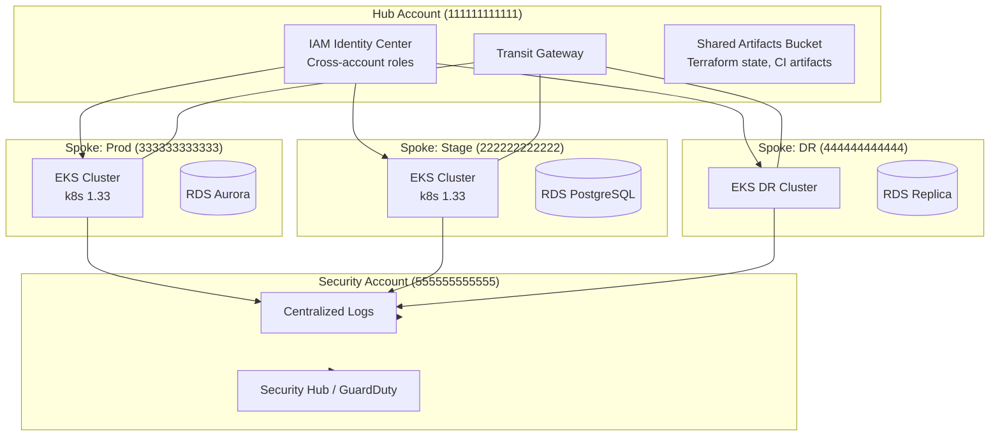

# Production Guardrails for AI Agents — The Risk Tier System Across 4 AWS Accounts

### How to let an AI act in a hub-spoke AWS topology without letting it torch production

*By June Gu — SRE at Placen (a NAVER subsidiary), Ex-Coupang. Building [Aegis](https://github.com/JIUNG9/aegis), an open-source AI-Native DevSecOps Command Center.*

---

## The hook

**AI agents without guardrails are a production incident waiting to happen.**

Especially when you have 4 AWS accounts in a hub-spoke topology, Transit Gateway between them, and an AI that can — if you let it — kubectl-scale, s3-copy, or modify an IAM policy that's trusted by every account downstream.

I work in a setup like that. At Placen (a NAVER subsidiary), our production AWS footprint spans several accounts wired through Transit Gateway. Before we let Aegis do anything autonomously, we had to answer a question every AI-in-production team eventually faces:

> "Which actions can the AI take on its own? Which require a human? Which should never be automated, ever?"

This article is my answer — the **risk tier system** that Aegis Layer 4 enforces, and why we designed it this way. It's what Aegis will ship as Layer 4 (Guardrails), coming in the v4.0 roadmap. Code references below point at planned files; the design is locked, the code is landing.

> "The speed of an AI agent is its biggest feature and its biggest liability. Guardrails are how you keep the feature and remove the liability."

---

## Part 1: The scale of the problem

Let me set the scene. A multi-account AWS topology gives you:

- **Blast radius isolation** — a bug in one account doesn't trash the others
- **Billing clarity** — per-account cost reports
- **IAM boundaries** — cross-account roles are explicit, not implicit
- **Compliance boundaries** — SOC2 audit scope can be per-account

But it also gives you:

- **Cross-account role trust** — if you mess up an IAM role in the hub, you can break access in every spoke
- **Transit Gateway coupling** — a bad security group in one account can reach another
- **Shared services** — a single S3 bucket used by 3 environments becomes a correlation hazard

Now add an AI agent. The agent is intelligent, helpful, and — at 3 AM — operating faster than any human. It notices elevated errors in the `auth-service` deployment in spoke-prod. It proposes a fix. It's about to run `kubectl scale deployment auth-service --replicas=7` in the spoke-prod EKS cluster.

Is that OK?

It depends on about 12 things. The job of the guardrails layer is to answer those 12 things in milliseconds, deterministically, auditably, every time. Let me walk through how.

---

## Part 2: Our topology (anonymized)

Here's the shape of a typical multi-account setup. The account IDs are placeholders — I'm using `111111111111` through `555555555555` throughout this article so nothing here leaks anything real:



So: **1 hub, 3 spokes, 1 security/observability tap.** An AI operating in this topology must understand three things simultaneously:

1. Which account is the target of the action?
2. What's the blast radius inside that account?
3. Does the action cross account boundaries at all? (If yes, default to BLOCKED unless explicitly whitelisted.)

These three become inputs to the risk assessment.

---

## Part 3: Risk classification deep dive

Here's the master table Aegis Layer 4 enforces. Each row: an action type, its default risk tier, an AWS-specific example, and the automation behavior.

[IMAGE: risk-tier-matrix.png — 20-row color-coded matrix showing Action Type, Risk Tier (NONE/LOW/MEDIUM/HIGH/BLOCKED), AWS example, and automation behavior. Render as 1600×900 PNG for Medium. Until rendered, the grouped bullets below carry the same information.]

**NONE tier — auto, no approval, no dry-run:**

- **CloudWatch log query** — `filter-log-events` on `/aws/eks/cluster-name`
- **CloudWatch metric read** — `get-metric-statistics` on EKS pod metrics
- **Describe resources** — `describe-db-instances`, `describe-clusters`
- **kubectl get / logs / describe** — e.g. `kubectl get pods -n auth`

**LOW tier — auto-approve with dry-run; post-verify:**

- **kubectl rollout restart (spoke)** — `kubectl rollout restart deploy/auth-service` in a spoke
- **kubectl scale up (spoke)** — `kubectl scale --replicas=7` (from 3) in a spoke

**MEDIUM tier — Slack approval required:**

- **kubectl scale down (spoke)** — `kubectl scale --replicas=1` (from 5) in a spoke
- **kubectl delete pod (spoke)** — `kubectl delete pod auth-xxxx`
- **kubectl rollout undo (spoke)** — roll back to previous ReplicaSet

**HIGH tier — manual only, no AI execution ever:**

- **Terraform apply (any account)** — `terraform apply` on any state file
- **kubectl delete (non-pod)** — `kubectl delete deployment auth-service`
- **RDS stop / modify** — `aws rds modify-db-instance`
- **Any action in hub account** — anything touching `111111111111`, regardless of category
- **Security Group rule modify** — `ec2 authorize-security-group-ingress`

**BLOCKED tier — hard-coded, never automated:**

- **Any action in security account** — anything touching `555555555555`
- **IAM policy modify** — `iam put-role-policy`, `iam attach-role-policy`. AI literally cannot attempt this.
- **S3 public-access config change** — `s3api put-public-access-block`
- **S3 bucket policy modify** — `s3api put-bucket-policy`
- **Cross-account IAM role change** — `iam update-assume-role-policy`
- **KMS key policy modify** — `kms put-key-policy`

A few things to notice:

### The NONE tier is huge

Most of what an AI needs to do during an investigation is **read**. Aegis's investigation flow leans heavily on NONE-tier actions — log queries, metric reads, describe calls, kubectl reads. These run with zero friction, no approval, no audit overhead beyond the default trail. That's how we get fast investigations.

### The LOW tier is scale-up only

We made a deliberate call: **scale-up is LOW, scale-down is MEDIUM.** The asymmetry matters. A scale-up from 3 to 7 replicas is reversible in 30 seconds and only risks over-provisioning cost for that window. A scale-down from 5 to 1 during an incident is how you turn a warning into a page. Asymmetric risk gets asymmetric treatment.

### The HIGH tier captures "manual only"

Terraform apply, kubectl delete (for non-pods), RDS modifications — these go to a human every single time. The AI can *propose* them. It can *describe* them. It can build the change set. It cannot execute them. I'll explain why in Part 7.

### The BLOCKED tier is code-level, not config-level

IAM modifications, S3 public-access, cross-account role changes, KMS key policies — these are **not overridable**. They're not a config toggle that an admin can flip. The code path literally does not exist for the AI to emit those actions. If a user asks the agent "please update the IAM policy for role X," the agent responds with "I cannot do that — this is hard-blocked. Here's the exact Terraform diff you'd need to apply manually." This is the most important design decision in the whole guardrails system.

> "The only way to make sure an AI never modifies IAM is to never write the code that would let it."

---

## Part 4: Hub-spoke guardrails — account-scoped actions

The tier table above is global. But in a hub-spoke topology, **every action is also scoped to an account**, and the account scope can upgrade the risk tier. Here's the rule:

```python
# apps/ai-engine/guardrails/risk_assessor.py  (coming in Layer 4 — see roadmap)

from enum import Enum

class Tier(Enum):
    NONE = 0
    LOW = 1
    MEDIUM = 2
    HIGH = 3
    BLOCKED = 4

HUB_ACCOUNT     = "111111111111"
SECURITY_ACCT   = "555555555555"
SPOKE_ACCOUNTS  = {"222222222222", "333333333333", "444444444444"}

def adjust_for_account(base_tier: Tier, account_id: str) -> Tier:
    # Security account: nothing mutating, ever
    if account_id == SECURITY_ACCT and base_tier != Tier.NONE:
        return Tier.BLOCKED

    # Hub: everything mutating becomes HIGH (manual only)
    if account_id == HUB_ACCOUNT and base_tier != Tier.NONE:
        return Tier.HIGH

    # Unknown account: default to BLOCKED
    if account_id not in SPOKE_ACCOUNTS | {HUB_ACCOUNT, SECURITY_ACCT}:
        return Tier.BLOCKED

    # Spokes: keep the base tier
    return base_tier
```

The logic is: **the hub is sacred**, **the security account is read-only**, **spokes are where automation is allowed**. An AI proposing to kubectl-scale the stage cluster (`222222222222`) is in a fundamentally different position than one proposing to touch anything in the hub.

Critically, **the AI never has the credentials to cross an account boundary on its own**. The execution layer authenticates into one account at a time, using a dedicated IAM role with a scoped permission boundary. If the AI tries to emit an action targeting a different account, the execution layer rejects it before any AWS API is even called. This is defense-in-depth — the risk classifier says no, *and* the credential scope says no.

See the planned implementation at [`apps/ai-engine/guardrails/risk_assessor.py`](https://github.com/JIUNG9/aegis) and the account-boundary check at [`apps/ai-engine/guardrails/engine.py`](https://github.com/JIUNG9/aegis).

---

## Part 5: Pre-validation — dry-run, IAM simulator, policy simulator

Before any action above NONE gets executed, the guardrails pre-validator runs three checks:

### 5.1 Dry-run

Every mutating action must support a dry-run path. For Kubernetes, that's `--dry-run=server`. For AWS CLI, it's `--dry-run`. For kubectl with no native dry-run (e.g., `rollout restart`), Aegis synthesizes a dry-run by computing the predicted outcome (which pods would restart, in what order) without applying it.

The dry-run result has a binary safety gate: if the dry-run fails for any reason (schema validation, permission denied, resource not found), the action is blocked and escalated to a human.

### 5.2 IAM simulator

The planned AWS IAM simulator check — `iam simulate-principal-policy` — verifies that the executor role actually has the permission to perform the action **before** attempting it. This catches two bug classes:

- **Permission drift** — someone revoked a permission and nobody updated the automation. The simulator catches this before runtime failure.
- **Unexpected allow** — someone *added* a permission the AI shouldn't have. The AI's expected scope is in a config file; if the simulator says "you can do more than expected," that's a flag.

### 5.3 Policy simulator (K8s side)

For cluster-side actions, Aegis runs a Kubernetes admission-style check using OPA (Open Policy Agent). The policies are versioned in the Aegis repo and cover:

- "No scaling below 2 replicas for services marked `tier: critical`"
- "No pod deletions in `kube-system`, `istio-system`, `cert-manager`"
- "No rollout-undo to a ReplicaSet older than 7 days"

```rego
# apps/ai-engine/guardrails/policies/scale_down.rego  (coming in Layer 4 — see roadmap)
package aegis.guardrails

deny[msg] {
  input.action == "scale"
  input.target.labels.tier == "critical"
  input.new_replicas < 2
  msg := sprintf("Cannot scale critical service %v below 2 replicas (requested %d)",
                 [input.target.name, input.new_replicas])
}
```

> "Dry-run catches syntax errors. IAM simulator catches permission errors. OPA catches policy errors. None of the three is sufficient alone. All three are required."

---

## Part 6: Post-validation — did the metrics actually improve?

Executing the action is not the end of the guardrail. **Post-validation** watches the metrics for N minutes after the action and compares against the predicted effect. This is the single most important quality-of-life feature for AI agents in production.

Example:

```
Action:      kubectl scale deployment auth-service --replicas=5 (from 3)
Rationale:   Elevated P99 latency; pattern analyzer predicted scale-up would help
Prediction:  P99 to drop below 300ms within 5 minutes
Execution:   Completed at 09:14:22 KST
Observe:     Watching metric auth-service.latency.p99 for 10 minutes

09:15:00 — P99: 1180ms  (no change yet, expected)
09:17:00 — P99:  640ms  (improvement, but not at target)
09:19:00 — P99:  280ms  (target reached)
09:24:00 — P99:  240ms  (stable below target)

Result: SUCCESS. Action retained.
```

And the failure mode:

```
Action:      kubectl rollout restart deployment/payment-worker
Rationale:   Memory leak symptoms
Prediction:  Memory steady-state reset; no error rate change
Execution:   Completed at 14:22:08 KST
Observe:     Watching error_rate and memory_rss for 10 minutes

14:23:00 — error_rate: 0.2%  memory: 82%
14:25:00 — error_rate: 8.1%  memory: 45%   (!)
14:27:00 — error_rate: 9.4%  memory: 48%   (!)

Result: FAILURE (error_rate regressed). Auto-rollback initiated.
Rollback: kubectl rollout undo deployment/payment-worker
Post-rollback metric check: ...
```

The post-validator has three outcomes:

1. **SUCCESS** — metrics match the prediction. Audit as successful.
2. **INCONCLUSIVE** — metrics didn't regress but didn't match the prediction. Flag for human review, do not rollback.
3. **FAILURE** — metrics regressed. Auto-rollback. Human page.

See [`apps/ai-engine/guardrails/post_validator.py`](https://github.com/JIUNG9/aegis) and [`apps/ai-engine/guardrails/rollback_manager.py`](https://github.com/JIUNG9/aegis) — both coming in Layer 4.

---

## Part 7: The "AI can't touch IAM" rule — hard-coded

This is the part everyone skims. Don't skim this part.

IAM is the hardest thing in AWS. It's also the thing an AI would *most* like to "fix" during an incident, because 60% of AWS production issues at some point have an IAM component. "Permission denied on cross-account role assumption" is a phrase every SRE knows.

The temptation is to let the AI propose an IAM fix. "Just add this one statement, boss, it'll unblock the service." And it will — and it'll also, five months later, be the line in the audit log that made your SOC2 auditor put down their pen and say, "We need to talk about this."

Aegis's rule: **the AI cannot emit an IAM-modifying action. Ever. For any reason. Under any escalation path.** This is enforced at three levels:

1. **Code path doesn't exist.** There's no `guardrails/actions/iam_modify.py`. The tool registry doesn't list it. The MCP tool catalog doesn't include it. If an LLM hallucinates an IAM-modify action, the executor looks it up, finds nothing, and refuses.
2. **Credential scope doesn't permit it.** The IAM role the executor assumes has an explicit `Deny iam:*` on its permissions boundary. Even if someone malicious injected an IAM-modify call, AWS would reject it.
3. **Audit picks it up.** CloudTrail in the security account (`555555555555`) has an alarm on any `iam:*` call from the executor's principal ARN. If one ever fires, someone gets paged immediately.

Three layers of defense. All three have to fail for an IAM change to happen.

> "The right way to avoid an AI going rogue on your IAM is not 'better prompting' or 'approval gates.' It's to never grant the permission in the first place."

The same treatment goes for S3 public-access changes, bucket policies, KMS key policies, and cross-account trust relationships. These are the "never" list, and they're enforced at the code level, not the config level.

---

## Part 8: Audit trail per account (SOC2 angle)

Every decision the guardrails engine makes is logged — and not just "was the action successful" logging. The audit log captures the full decision tree. SOC2 (and our internal security review) wants to see that the system behaves predictably, and the audit log is the evidence.

Structure of a decision record:

```json
{
  "decision_id": "GRD-2026-0419-00042",
  "timestamp": "2026-04-19T09:14:22.145Z",
  "investigation_id": "INV-2026-0419-00017",
  "account_id": "333333333333",
  "action": {
    "type": "kubectl_scale",
    "target": "deployment/auth-service",
    "namespace": "auth",
    "old_replicas": 3,
    "new_replicas": 5
  },
  "classification": {
    "base_tier": "LOW",
    "account_adjusted_tier": "LOW",
    "rationale": "Spoke account; scale-up is LOW"
  },
  "pre_validation": {
    "dry_run": { "status": "safe", "latency_ms": 142 },
    "iam_simulator": { "status": "allowed", "latency_ms": 89 },
    "opa_policy": { "status": "allowed", "latency_ms": 12 }
  },
  "approval": {
    "mode": "auto_approved",
    "approved_by": "aegis-guardrails",
    "human_required": false
  },
  "execution": {
    "status": "success",
    "started_at": "2026-04-19T09:14:22.300Z",
    "completed_at": "2026-04-19T09:14:23.022Z"
  },
  "post_validation": {
    "window_minutes": 10,
    "predicted": { "p99_ms": 300 },
    "observed": { "p99_ms": 240 },
    "status": "SUCCESS"
  },
  "rollback_available_until": "2026-04-19T09:29:22.300Z",
  "model": "claude-sonnet-4-7",
  "tokens_used": 11420,
  "cost_usd": 0.074
}
```

These records are written to two places:

1. **Local append-only log** (`apps/ai-engine/guardrails/audit_logger.py`) — for fast query
2. **Centralized log aggregator in the security account** (`555555555555`) — immutable, retention-controlled per SOC2 policy

The auditor asks: "Show me every mutating action your AI took last month." The answer is a SQL query against the centralized log. Per-account filtering is native — you can show only actions that touched prod, or only actions in stage, or all actions in both.

See the planned audit logger at [`apps/ai-engine/guardrails/audit_logger.py`](https://github.com/JIUNG9/aegis).

---

## Part 9: Rollback-first policy

A core invariant of Aegis's Layer 4: **no action executes without a documented rollback plan.** The guardrails engine validates this before approval. A proposed action looks like:

```json
{
  "action": {
    "type": "kubectl_scale",
    "target": "deployment/auth-service",
    "old_replicas": 3,
    "new_replicas": 5
  },
  "rollback": {
    "type": "kubectl_scale",
    "target": "deployment/auth-service",
    "to_replicas": 3,
    "timeout_seconds": 120
  },
  "rollback_sla_minutes": 15
}
```

If `rollback` is missing, the action is blocked. The rollback must be executable by the same executor principal (i.e., the AI must have permission to undo what it does). The rollback SLA is a maximum window during which automatic rollback is armed — after the SLA expires, rollback goes back to manual.

Three categories of action are **inherently non-rollback-safe** and therefore must be HIGH tier regardless:

1. **Anything that deletes data irrevocably** (pod eviction with PVC deletion, DB drop, S3 object delete without versioning)
2. **Anything that mutates shared global state** (DNS record, certificate rotation)
3. **Anything that crosses account boundaries** (handled separately — BLOCKED)

> "If you can't describe how to undo it, you don't get to do it."

See [`apps/ai-engine/guardrails/rollback_manager.py`](https://github.com/JIUNG9/aegis) — coming in Layer 4.

---

## Part 10: A real example (anonymized)

Here's the kind of story that happens at 09:15 KST on a Monday — the same Monday we were looking at in [the last article](https://github.com/JIUNG9/aegis).

### Timeline

- **09:12:04** — SigNoz fires alert: `auth-service` P99 > 1000ms (threshold 500ms)
- **09:12:08** — Aegis orchestrator picks up alert, opens investigation `INV-2026-0419-00017`
- **09:12:10** — Wiki context fetched: 3 pages on auth-service scaling
- **09:12:12** — Pattern analyzer returns: "Pattern A match — Mon 9AM cold-start, 26 prior occurrences"
- **09:12:15** — Claude (Sonnet) proposes: scale 3 -> 5 replicas, pre-warm connection pool
- **09:12:16** — Guardrails engine evaluates: target account `333333333333` (spoke-prod, permitted); action `kubectl_scale` up classifies LOW; account adjustment keeps it LOW (no upgrade); rollback plan provided.
- **09:12:17** — Pre-validation: dry-run SAFE, IAM simulator ALLOWED, OPA ALLOWED
- **09:12:17** — Approval: auto-approved (LOW tier, all checks passed)
- **09:12:18** — Execution: `kubectl scale deployment auth-service --replicas=5`
- **09:12:19** — Execution succeeded; rollback window armed until 09:27:18
- **09:12:20** — Post-validation watch started, 10-minute window
- **09:15:00** — P99 down to 640ms (improving)
- **09:17:00** — P99 down to 280ms (target reached)
- **09:22:30** — Post-validation: SUCCESS. Audit record finalized.

Total AI-operator time from alert to mitigation: **13 seconds.**
Human involvement: zero (because the action was LOW tier in a spoke account, with a valid rollback).

### What the human saw

At 09:30 KST, when the team came online, the Slack `#sre-ai-audit` channel had a single message:

> **[AUDIT]** `GRD-2026-0419-00042` — `auth-service` scaled 3 -> 5 in `333333333333`. Trigger: P99 alert. Pattern A match. Auto-approved LOW. Post-validation SUCCESS (P99 240ms). Rollback available until 09:27:18.

No page. No panic. Just a log entry. That's what the guardrails system buys you.

---

## Part 11: What if something goes wrong?

I've been painting a happy path. Let me paint the unhappy one, because that's where guardrails earn their keep.

### Scenario: post-validation fails

Same setup as above, but post-validation detects P99 *rose* instead of falling (unlikely for a scale-up, but suppose a load balancer misconfig).

```
09:17:00 — P99: 1400ms (worse)
09:19:00 — P99: 1520ms (worse)
09:20:00 — Rollback triggered (auto)
09:20:12 — kubectl scale --replicas=3 executed
09:23:00 — P99: 1180ms (back to pre-action baseline)
09:23:05 — Rollback post-validation: metrics back to baseline, not target
09:23:06 — PagerDuty fires: "AI mitigation failed, human required"
09:23:08 — Investigation escalated to next-in-rotation
```

The rollback-first policy turns a potential 30-minute outage into a 7-minute one, and *always* gets a human involved when the AI's intervention doesn't land. This is the SLA-positive behavior you want.

### Scenario: AI tries to touch IAM (somehow)

The LLM, for whatever reason, emits an action like `iam put-role-policy`. What happens:

1. The action goes to the guardrails engine.
2. The engine looks up the action type in its registry. Not found.
3. The engine rejects: "Unknown action type. Blocked."
4. Audit log: "Blocked attempt: LLM proposed IAM action."
5. If this happens more than once, a high-severity alarm fires. Someone investigates the prompt.

The AI can *suggest* IAM changes as natural-language recommendations to a human. It can't *emit* them as structured actions. This is by design.

### Scenario: compromised LLM output

Hypothetical worst case: some adversarial input causes the LLM to emit a well-formed action that the guardrails engine accepts as LOW, but which is actually harmful.

Defenses:

1. **Dry-run** catches most shape errors
2. **OPA policy** catches "scaling below 2 replicas for critical service"
3. **Credential scope** prevents it from touching anything outside the spoke account
4. **Post-validation** catches the regression and auto-rollbacks

Four layers. All four have to fail. In practice, the failure mode is "the AI picked the wrong action but it didn't do damage."

---

## Part 12: Implementation — where the code lives

All paths relative to the [JIUNG9/aegis](https://github.com/JIUNG9/aegis) repo. Layer 4 files are planned — coming in Layer 4 per the roadmap.

- **[`apps/ai-engine/guardrails/engine.py`](https://github.com/JIUNG9/aegis)** — Main guardrails orchestrator
- **[`apps/ai-engine/guardrails/risk_assessor.py`](https://github.com/JIUNG9/aegis)** — Classifies actions into NONE/LOW/MEDIUM/HIGH/BLOCKED
- **[`apps/ai-engine/guardrails/observation_mode.py`](https://github.com/JIUNG9/aegis)** — Trust-building ladder (Observe / Recommend / Low-Auto / Full-Auto)
- **[`apps/ai-engine/guardrails/approval_gate.py`](https://github.com/JIUNG9/aegis)** — Slack approval integration for MEDIUM tier
- **[`apps/ai-engine/guardrails/pre_validator.py`](https://github.com/JIUNG9/aegis)** — Dry-run, IAM simulator, OPA checks
- **[`apps/ai-engine/guardrails/post_validator.py`](https://github.com/JIUNG9/aegis)** — Metric watch + auto-rollback trigger
- **[`apps/ai-engine/guardrails/rollback_manager.py`](https://github.com/JIUNG9/aegis)** — Enforces rollback plan; arms rollback window
- **[`apps/ai-engine/guardrails/audit_logger.py`](https://github.com/JIUNG9/aegis)** — SOC2-compliant decision record writer
- **[`apps/ai-engine/guardrails/policies/`](https://github.com/JIUNG9/aegis)** — OPA/Rego policies (versioned)

Environment variables the guardrails engine expects:

```bash
AEGIS_HUB_ACCOUNT=111111111111
AEGIS_SECURITY_ACCOUNT=555555555555
AEGIS_SPOKE_ACCOUNTS=222222222222,333333333333,444444444444
AEGIS_AUTOMATION_STAGE=recommend   # observe | recommend | low-auto | full-auto
AEGIS_SLACK_APPROVAL_CHANNEL=sre-ai-approvals
AEGIS_AUDIT_LOG_BUCKET=s3://aegis-audit-555555555555/logs
```

The automation stage ladder (`observe` -> `recommend` -> `low-auto` -> `full-auto`) is how we rolled this out. For the first 4 weeks, Aegis was in `observe` — it watched incidents, logged what it would have proposed, and didn't show recommendations to the team. Then `recommend` for 3 weeks — the team saw proposals and approved them manually. Only after that did we turn on `low-auto` for the LOW tier. **Build trust. Don't shortcut.**

---

## Part 13: Try it yourself

```bash
git clone https://github.com/JIUNG9/aegis.git
cd aegis

# Configure your account topology
cp .env.example .env
# Edit AEGIS_HUB_ACCOUNT, AEGIS_SPOKE_ACCOUNTS, etc.

pnpm install
pnpm dev

# Start in observe mode, always
export AEGIS_AUTOMATION_STAGE=observe
```

If you want to experiment with the risk classifier directly, once Layer 4 lands there'll be a CLI:

```bash
aegis guardrails classify \
  --action kubectl_scale \
  --target deployment/auth-service \
  --account 333333333333 \
  --old-replicas 3 --new-replicas 5

# Output:
# base_tier: LOW
# account_adjusted_tier: LOW
# dry_run: required
# approval: auto
```

Test the edge cases:

```bash
# Hub account: should become HIGH
aegis guardrails classify --action kubectl_scale --account 111111111111 ...
# Output: account_adjusted_tier: HIGH, approval: manual

# IAM action: should be hard-blocked
aegis guardrails classify --action iam_put_role_policy ...
# Output: ERROR — unknown action type (hard-blocked; no code path exists)

# Unknown account: should be BLOCKED
aegis guardrails classify --action kubectl_scale --account 999999999999 ...
# Output: account_adjusted_tier: BLOCKED
```

---

## Part 14: What's next — the career capstone

Six articles in, we've covered:
- Layer 1: LLM Wiki (replacing RAG)
- Layer 2: SigNoz Connector + pattern detection
- Layer 3: Claude Control Tower
- Layer 4: Production Guardrails (this article)
- Layer 5: MCP Document Reconciliation

The final article in this series is the career capstone: **"Open-Sourcing an AI-Native DevSecOps Platform — From Side Project to Portfolio Piece."** It's the story of why I built Aegis in the evenings, how the OSS-Medium-LinkedIn pipeline works, what I learned about platform engineering by doing it alone, and what I'm hoping to carry into my next role in Canada.

If you're a hiring manager reading this — hi. If you're an SRE reading this and thinking "I should build something like this" — do it. It's the highest-leverage portfolio piece I've ever worked on.

---

## Try Aegis

- GitHub: [github.com/JIUNG9/aegis](https://github.com/JIUNG9/aegis)
- The v4.0 plan (Layer 1-5 roadmap) is in the repo
- Issues and PRs welcome — especially if you've built similar guardrails and want to compare approaches

If you're running AI agents in production across multiple AWS accounts, I'd love to trade notes on what worked and what didn't. The hub-spoke guardrails problem is one where the community benefits from shared learning — we're all still figuring this out.

---

**Tags:** AI, Security, AWS, SRE, DevSecOps, Compliance

*Written by June Gu. SRE at Placen (a NAVER subsidiary), previously at Coupang (NYSE: CPNG) handling observability and SRE for 1M+ daily commerce transactions. Relocating to Canada in early 2027 and building Aegis as an open-source portfolio piece. Follow for more on AI-native DevSecOps.*
