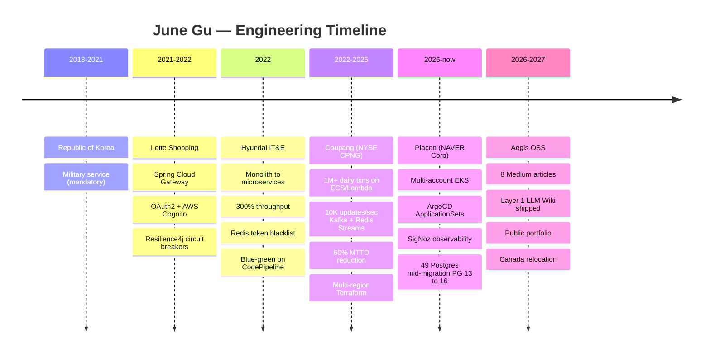
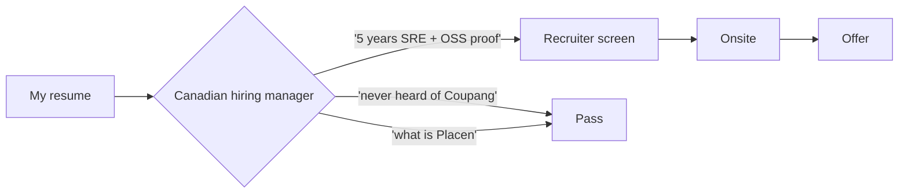
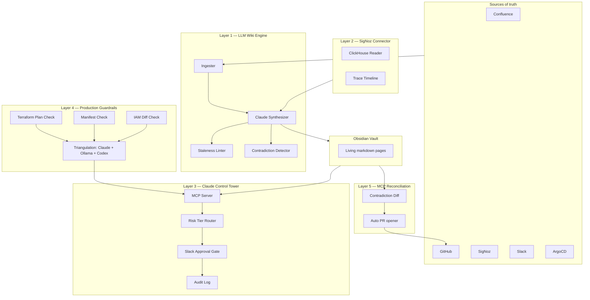
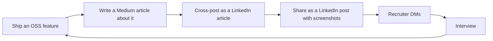

# Open-Sourcing an AI-Native DevSecOps Platform — From Side Project to Portfolio Piece

*Platform Engineering is Gartner's #1 trend. I built one in my evenings so recruiters in Canada would take me seriously.*

---

## Why I'm writing this one differently

The other seven articles in this series are technical. This one is not.

I'm an SRE at Placen, a subsidiary of NAVER Corporation, working out of Seoul. Before Placen I spent three years at Coupang (NYSE: CPNG) on cloud platforms and SRE. Before that, Hyundai IT&E on platform and cloud. Before that, Lotte Shopping on backend and cloud. I studied computer and information systems security at Tongmyong University, spent three years in the Republic of Korea military, and finished a second B.Eng in computer science at Kumoh National Institute.

None of those names register with a hiring manager in Toronto.

I'm aiming to relocate to Canada by February 2027. I hold a four-year Open Work Permit. I'm targeting Site Reliability, DevOps, and Platform Engineering roles in the Greater Toronto Area and Vancouver. And I know from looking at the market, talking to recruiters, and reading dozens of Canadian job postings that my resume alone is not going to carry the signal I need it to carry.

Aegis is how I'm fixing that.

This article is the capstone of an eight-part series. The first seven explained what Aegis does. This one explains why it exists.

> **If you're a Canadian tech recruiter or hiring manager reading this: skip to the last section. I made it easy.**

---

## The career arc so far — a quick walkthrough

Here is what my five years in industry actually look like, told by the systems I've shipped rather than the titles I've held.

### Lotte Shopping — Backend + Cloud (Mar 2021 to Mar 2022)

First real engineering job out of university. The team was migrating from a monolith to Spring Cloud Gateway microservices with OAuth2 and AWS Cognito for RBAC. My contributions were small but concrete: helped wire Resilience4j Circuit Breaker and Bulkhead patterns into the gateway, added CloudWatch and ELK dashboards so we could actually see what was happening. The lesson I took away was that observability is not a feature you add later. If you ship a service without logs and metrics, you have shipped a black box.

### Hyundai IT&E — Platform + Cloud (Apr 2022 to Sep 2022)

Short stint, big impact. We had an inherited monolith and a sprint budget to split it. I led a chunk of the monolith-to-microservices migration, which netted roughly a 300% throughput increase once contention on a shared database connection pool and session store went away. The interesting technical bit was a Redis-backed JWT blacklist — O(1) revocation lookups — which let us log users out globally during a credential rotation without bouncing pods. I also packaged some of our reusable DevOps scaffolding into shared libraries, cutting duplicated CI/CD boilerplate by about 30%.

> **Lesson I keep returning to: the most impactful platform work is the work that removes the need for other engineers to think about platform.**

### Coupang — Cloud Platforms & SRE (Oct 2022 to Nov 2025)

Coupang is the "Amazon of Korea" — NYSE-listed, ~$30B revenue, the dominant domestic e-commerce platform. I spent three years on teams responsible for the cloud platforms underneath production commerce.

The numbers that matter:

- **1M+ daily transactions** on AWS ECS Fargate and Lambda, backed by SQS for async work
- **Container cold-start reduced from 45s to 3s** through layer restructuring, base-image slimming, and pre-warmed task pools
- **10K+ updates/sec** through a hybrid Kafka + Redis Streams pipeline (Kafka for durability, Redis Streams for low-latency fan-out)
- **60% reduction in MTTD** after standing up a Prometheus and Grafana stack with proper SLIs, SLOs, and alerting that stopped paging on symptoms
- **Multi-region Terraform** with GitHub Actions and AWS CodeDeploy as the deployment substrate

Coupang is where I learned that scale is not a number, it is a discipline. A single badly-written cron job can take down a region. A single `terraform apply` without a plan review can delete an environment. Every control you build has to assume the worst version of yourself will eventually operate it at 3 AM.

### Placen (NAVER Corporation) — SRE (Jan 2026 to now)

Placen is a subsidiary of NAVER Corporation, Korea's largest internet company — NAVER is often called "the Google of Korea." NAVER acquired Placen in 2024 and we have been systematically modernizing the stack ever since.

What I work with day-to-day:

- AWS **multi-account hub-spoke** architecture (four AWS accounts plus the hub, connected through Transit Gateway)
- **Terraform 1.10+** with more than twenty reusable modules, S3 backend with native locking
- **EKS running Kubernetes 1.33** across accounts, deployed through ArgoCD ApplicationSets from a single GitOps repo
- **49 PostgreSQL instances** (RDS and Aurora) mid-migration from PG 13 to PG 16
- **External Secrets Operator**, Keycloak for OIDC SSO, SigNoz for observability, GitHub Actions Runner Controller for CI compute
- **Spring Boot microservices** on the application side (gateway, auth, user, SSE, admin, integration) with a React + Vite + Zustand frontend

The work is real SRE: error budgets, on-call rotation, post-mortems, capacity planning, platform toil reduction. Everything I write about in the other seven articles of this series is anchored in systems I touch every day at Placen.

---

## The gap that Aegis fills

Here is the honest problem I'm solving.

A hiring manager in Toronto does not know that Coupang is NYSE-listed, runs one of the largest commerce platforms in Asia, and has a cloud footprint comparable to a Tier-1 US e-commerce company. They do not know that Placen being acquired by NAVER is the Korean equivalent of being acquired by a FAANG. They do not know that my previous title translates cleanly to the North American SRE II / Senior SRE band.

Titles do not translate. Company names do not translate. Scale claims on a resume are unverifiable.

> **The only way to bridge that gap is to ship something public that demonstrates senior thinking, and to write about it the way senior engineers write.**

That is Aegis.

---

## What Aegis actually is

Aegis is an open-source AI-Native DevSecOps Command Center. It is six layers, each of which solves a real operational problem I have lived through on-call.

### The six layers

[IMAGE: assets/02-five-layers.png — six-row layer table for Aegis: Layer 0 Safety Foundation, Layer 1 LLM Wiki Engine, Layer 2 SigNoz Connector, Layer 3 Claude Control Tower, Layer 4 Production Guardrails, Layer 5 MCP Document Reconciliation. All six built and shipped.]

All six layers are built and pushed today. The next horizon is Phase 2 — turning Aegis from an *advisory* AI SRE into a *self-healing* one. That's covered in Article #12.

### Architecture at a glance

The thing I want to stress is that every layer has a clear "why." Each one came out of a specific incident, a specific 3 AM pager, a specific meeting where someone said "we should automate this but we can't because the AI might make it worse."

> **Aegis is not an AI demo. It is an opinion about how AI should operate in production, expressed as code.**

---

## The architecture is the resume

A resume says "reduced MTTD by 60%." That is a claim. It can be true, partially true, inherited from a team, or a polite exaggeration. A recruiter has no way to know.

An `ARCHITECTURE.md` in a public repo is different. It is a falsifiable document. You can read it, judge the diagrams, judge the trade-offs, judge the reasoning. You can click through to the code and see whether the repo actually does what the document claims.

Aegis is that falsifiable document. The decisions are written down. The reasoning is written down. The trade-offs are written down. The runtime cost is written down. When I interview for a senior role in Canada, I don't have to ask a hiring manager to take my word for any of it.

Here is an example. When I explain "why Karpathy's LLM Wiki pattern beats vanilla RAG for SRE knowledge bases," I do not have to wave my hands. I link to [Article 1](https://github.com/JIUNG9/aegis) and to the actual `synthesize.py` in the engine. When I explain "how I tier risk for AI agents," I link to [Article 5](https://github.com/JIUNG9/aegis) and to the MCP manifest in the repo. Each claim has receipts.

### The runtime cost — $15/month to run the whole thing

One thing that matters for the portfolio framing: Aegis is not a $10,000-a-month enterprise project dressed up as open source. It runs on a single cheap VPS, a small Postgres instance, and pay-per-use Claude API calls. Back of envelope:

[IMAGE: assets/03-monthly-cost.png — five-row monthly cost table (VPS $6, managed Postgres $4, object storage $1, Claude API $4) totalling ~$15/month to run Aegis]

That's the point. Enterprise-grade SRE tooling does not have to be enterprise-priced. The patterns that make production observability, knowledge management, and AI-agent governance work at scale also work on a hobbyist budget, because the hard part is design, not cost.

> **If the only way to prove you can build at scale is to spend at scale, most engineers will never get to prove it. That is the gap Aegis is trying to close for people like me.**

---

## What I learned building this

Five things I did not expect going in.

### 1. Karpathy's LLM Wiki pattern genuinely beats traditional RAG for SRE

I wrote a full article on this ([Article 1](https://github.com/JIUNG9/aegis)), but the short version: RAG retrieves similarity, not truth. For SRE knowledge, where contradictions between a 2023 runbook and a 2026 runbook are common and the wrong choice ends in an incident, similarity is the wrong signal. A pre-synthesized canonical page, rebuilt on source updates rather than rebuilt per query, is the right signal. It is also cheaper because synthesis happens once per update, not once per question.

### 2. Guardrails-first design is non-negotiable

I started Layer 3 (the Claude Control Tower) by asking "what agent actions are safe to automate?" and the answer was "almost none, until you have a tiered risk model and an approval path." Read operations — getting SigNoz traces, listing ArgoCD applications, searching the wiki — are safe by default. Write operations — scaling a deployment, rotating a secret, applying a Terraform plan — are never safe by default. They require an explicit approval in Slack, a full audit log, and a rollback path.

This sounds obvious written down. It is not how most AI agent demos work. Most demos are `agent.run()` with a shell tool and no brakes, and they are one rage-quit LLM away from a production incident.

### 3. OSS plus Medium plus LinkedIn is a deliberate career pipeline

Writing code and hoping recruiters find it on GitHub is not a strategy. Writing the code, writing the story of the code, and publishing both in a loop is a strategy.

Every OSS feature I ship in Aegis becomes a Medium article. Every article becomes a LinkedIn post. The feed, the blog, the repo, and the resume all point at each other. This is how you manufacture career surface area when you do not have the network.

### 4. Planning takes longer than building when you do it right

The Aegis v4.0 plan is longer than the v4.0 code I have shipped so far, and that is correct. Every bad software decision I have ever watched someone make in production started with under-planning. Layer 1 took me four evenings to plan and six evenings to build. Layer 3 will take me two weeks to plan because I want the risk model to be right the first time.

### 5. Writing is the compounding asset

Code rots. Repos get archived. Services shut down. A well-written Medium article that explains a pattern — with the trade-offs and the code links — lives forever and accrues views. I have articles from other engineers that I still reference five years after they were written. The articles are the thing recruiters find first. The code is what they verify with second.

> **The article is the map. The code is the territory. Both matter, but the map is what gets you interviews.**

---

## A short digression on why I'm not chasing certifications

I get this question almost every time I mention the relocation plan publicly, so let me address it here.

The certifications landscape for SRE and Platform Engineering roles — AWS Solutions Architect Associate, Certified Kubernetes Administrator, HashiCorp Terraform Associate, Google Professional Cloud Architect — is a ladder a lot of engineers climb reflexively. The logic is: "I want to work abroad, so I should get the certs that prove my skills in a vendor-neutral way."

I looked at it carefully and I decided against it, for three reasons that I think generalize.

**First**, the jobs I am targeting do not ask for them. I have screenshotted the "requirements" section of roughly thirty senior SRE and Platform Engineering postings in Toronto and Vancouver. The consistent ask is: years of hands-on experience with the stack, ability to design and operate systems at scale, ability to reason about reliability, ability to write clearly. Only two of the thirty mentioned a specific certification as a hard requirement.

**Second**, a certification is a lagging indicator. It proves you studied for an exam. A public repo proves you built something. When recruiters screen for senior roles, they are looking for signal of judgment — what you chose to build, how you reasoned about trade-offs, how you wrote about the result. An AWS SAA sticker on a LinkedIn profile is a nice-to-have but it is not what wins a shortlist spot.

**Third**, my time budget is finite. I have evenings and weekends for the next nine months. Every hour I spend grinding flashcards for a CKA exam is an hour I am not spending on Phase 2 of Aegis (the self-healing executor), or on the next Medium article, or on the Terraform modules I'm planning to open-source. The opportunity cost is real.

This is a deliberate bet, not a shortcut. If a specific job posting in the final stretch tells me "offer conditional on CKA," I will book the exam that week and pass it. Until then, I would rather ship the thing that proves the skill than study for the thing that certifies it.

> **Certifications are a floor. Open source portfolios are a ceiling. I know which one I need more of at this point in my career.**

---

## What's next

The rest of 2026 and the first months of 2027 look like this:

[IMAGE: assets/04-roadmap.png — roadmap from April 2026 through February 2027. Done: Layers 0-5 shipped, Articles #1-#11 drafted, OSS hygiene CI live. Planned: P2.1-P2.5 Phase 2 features (Control Tower wiring, MCP FinOps, Excel export, periodic scheduler, Layer 4 executor), Article #12 on the executor, three Terraform modules, NAVER Tier C deployment, IELTS, Canada move Feb 2027.]

Certifications are on the "only if a job posting requires one" list. I have looked at dozens of Canadian SRE and Platform Engineering postings, and the ones I am targeting consistently ask for demonstrable hands-on experience with the stack I already run. If a specific posting demands AWS Solutions Architect Associate, Certified Kubernetes Administrator, or Terraform Associate, I will take the exam. Otherwise that time is better spent shipping Layer 4 or writing Article 12.

Medium cadence is two articles per month, non-negotiable. LinkedIn cadence is one substantive post per week. GitHub cadence is at least one meaningful commit to Aegis every weekend.

---

## For Canadian recruiters and hiring managers reading this

I'll make it easy for you.

- **Immigration status**: four-year Open Work Permit, eligible to start work in Canada without further sponsorship
- **Target relocation**: February 2027, Greater Toronto Area preferred, Vancouver acceptable
- **Target roles**: Senior SRE, Platform Engineer, DevOps Engineer, Cloud Infrastructure Engineer
- **Target compensation band**: senior individual contributor, open on level after conversation
- **Stack I can run on day one**: AWS multi-account, EKS, Terraform, ArgoCD, Spring Boot, Postgres, Prometheus/SigNoz/Grafana, CI/CD through GitHub Actions or CircleCI
- **Stack I can learn quickly**: GCP, Azure, Datadog, Bazel, Rust on the infrastructure side

What Aegis proves about me that a resume cannot:

1. I can design a system from first principles, not just maintain someone else's
2. I can ship an open-source project with real architecture decisions and real documentation
3. I can write about engineering the way senior engineers write
4. I am serious enough about the Canadian market to have structured the last year of my free time around it

If any of that resonates, please reach out. The links are at the bottom of this article.

---

## Thanks

To the open source community that makes all of this possible — Obsidian, SigNoz, ArgoCD, Terraform, ClickHouse, Postgres, and the thousand libraries in between. To Andrej Karpathy for the LLM Wiki sketch that inspired Layer 1. To the Conf42 SRE community for showing me how to write and speak about SRE publicly. To every engineer who has written a Medium article that explained a hard thing clearly — you are the reason this industry is accessible to people who do not work at brand-name companies from day one.

To the Korean tech scene, which trained me in scale, discipline, and overnight pager handoffs. You don't get a lot of credit in English-language engineering writing, and you should.

---

## Links

- **Aegis OSS repo**: [github.com/JIUNG9/aegis](https://github.com/JIUNG9/aegis)
- **Aegis Wiki (live portfolio vault)**: [github.com/JIUNG9/aegis-wiki](https://github.com/JIUNG9/aegis-wiki)
- **LinkedIn**: [linkedin.com/in/jiung-gu](https://www.linkedin.com/in/jiung-gu)
- **Medium**: [medium.com/@june.gu](https://medium.com/@june.gu)
- **Email for recruiters**: via LinkedIn DM

---

*This is the capstone of an eight-part series on the Aegis v4.0 architecture. Previous articles cover the LLM Wiki pattern, AI hallucination in SRE contexts, self-maintaining knowledge bases, the automation ladder, Claude-driven on-call, Monday-morning incident patterns, and multi-account AWS guardrails. If any of that sounds relevant, start at Article 1.*

**Tags**: Open Source, Career, Platform Engineering, SRE, AI, DevOps, Canada, Immigration
