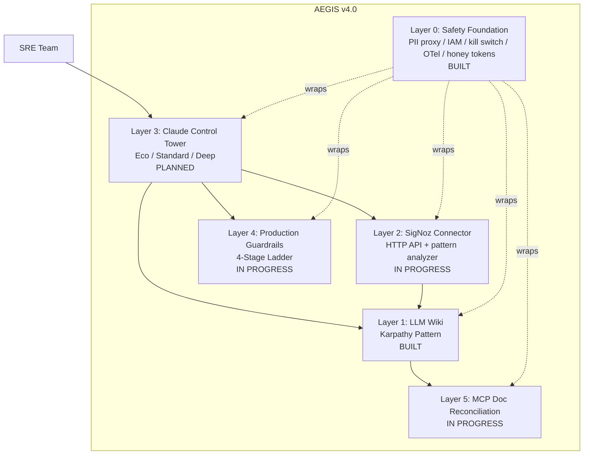
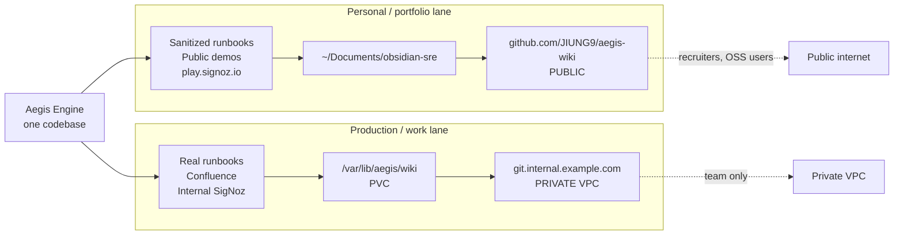
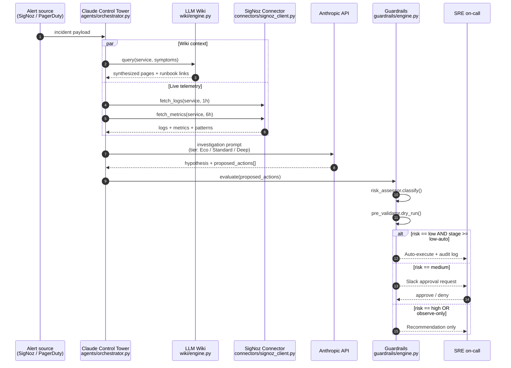
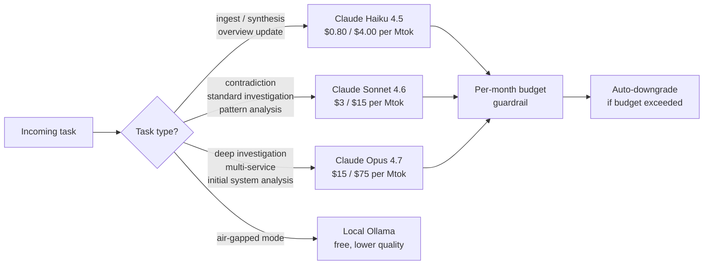
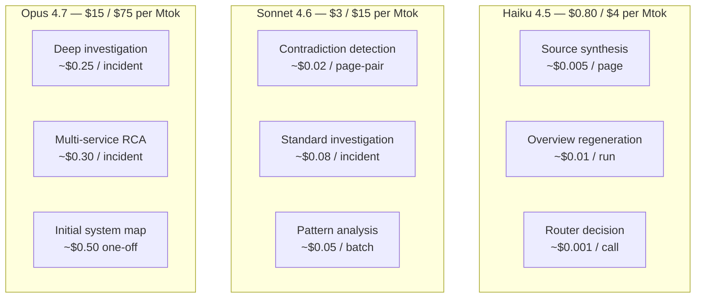
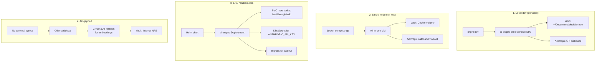
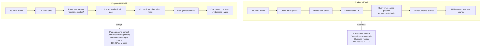
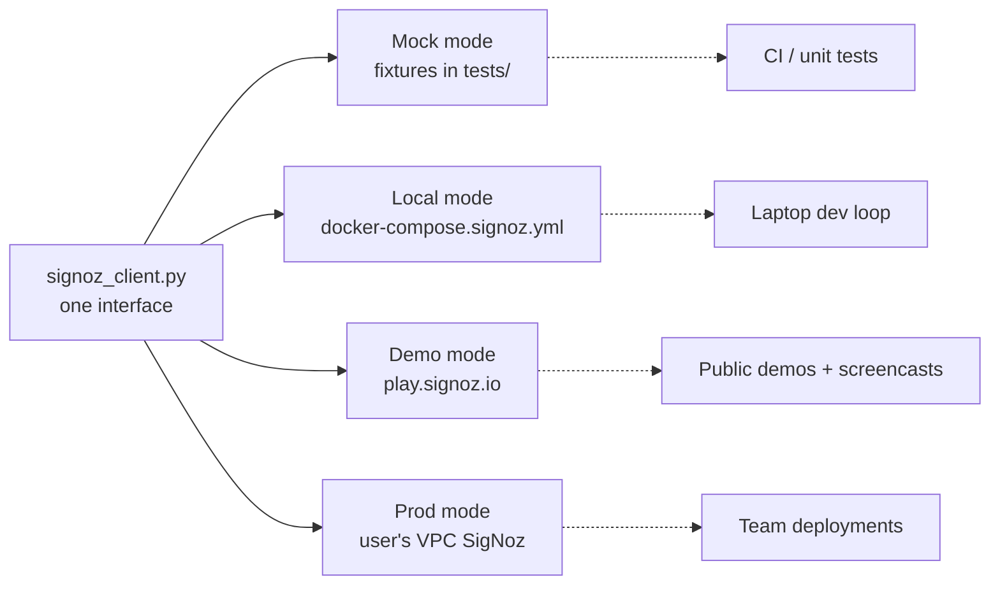
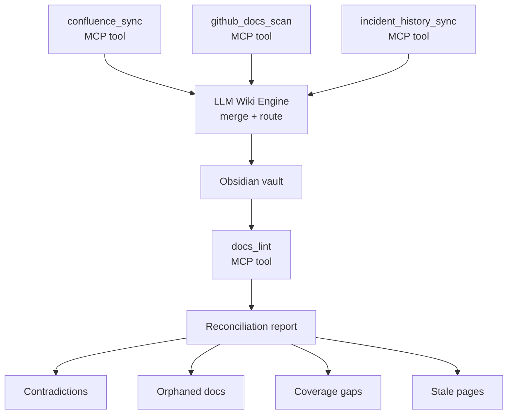

# Aegis Architecture

**Version**: 4.0
**Status**: Layers 0 + 1 built (2026-04-21). Layers 2, 4, 5 in active development. Layer 3 blocked on Layer 2 interfaces.
**Repository**: `github.com/JIUNG9/aegis`
**Audience**: contributors, self-hosters, and reviewers evaluating the project for adoption.

---

## 1. Executive Summary

Aegis is an AI-native DevSecOps command center built around a single idea: the operational knowledge a team needs in the middle of an incident should be pre-synthesized, not chunked and retrieved. A Large Language Model reads every runbook, post-mortem, Confluence page, and resolved incident exactly once, distills them into an Obsidian vault of canonical wiki pages, and then answers queries against that synthesized knowledge instead of against raw document fragments. The investigation loop sits on top of that vault: when an alert fires, Aegis pulls the relevant wiki context, enriches it with live telemetry from SigNoz, hands the bundle to Claude for analysis, and gates any proposed action through an explicit guardrails ladder. The platform ships as a five-layer stack — only Layer 1 is built today; the remaining four are planned and scoped in detail below.



The differentiator is explicit: traditional RAG treats documents as a bag of chunks. Aegis treats them as a living knowledge base that catches contradictions at ingest time, tracks staleness per source, and publishes the result as a public Obsidian vault — which doubles as a portfolio artifact for the operator.

---

## 2. The Six Layers

Each layer lives in its own Python package under `apps/ai-engine/`. Layer 0 is the safety foundation every other layer inherits automatically — the rule is **safety as shipped features, not operator discipline**. Layers 1–5 compose top-to-bottom: the Control Tower (L3) calls into the Wiki (L1), the SigNoz Connector (L2), and the Guardrails (L4). The MCP Reconciliation (L5) writes back into L1.

### Layer 0 — Safety Foundation (ships inside every deployment)

| Field | Value |
| --- | --- |
| **Status** | Built |
| **Purpose** | Make Aegis deployable by any engineer in any regulated environment. Every safety primitive is enforced by code in the repo, not by documentation or checklists. |
| **Mental model** | If a safety rule can only be upheld by an operator remembering to do something, it is not a safety rule — it is a bug waiting for a bad day. |

The eight features in Layer 0, each enabled by default, each configurable via `aegis.config.yaml`:

| # | Feature | Location | What it enforces |
| --- | --- | --- | --- |
| 0.1 | PII Redaction Proxy | `apps/ai-engine/proxy/` | Scrubs PII, secrets, hostnames from every outbound Claude API call. Reverse-substitutes placeholders on response. |
| 0.2 | Cloud IAM Templates | `deploy/iam/{aws,gcp,azure}/` | Drop-in read-only policies with explicit `Deny` guards. Writes are technically impossible, not discouraged. |
| 0.3 | Kill Switch + `aegis panic` CLI | `apps/ai-engine/killswitch/` | Redis-backed flag every MCP tool checks. Panic CLI optionally attaches `Deny *` to the agent's IAM role. |
| 0.4 | Local LLM Router | `apps/ai-engine/llm_router/` | Sensitive prompts route to local Ollama; sanitized to Claude API. Cross-border transfers become an opt-in. |
| 0.5 | OTel GenAI Tracing | `apps/ai-engine/telemetry/` | Every LLM call + MCP tool call emits a signed exportable trace. Provable audit trail for regulators. |
| 0.6 | Honey Token Beacon | `apps/ai-engine/honeytokens/` | Tripwires planted in the vault. Every outbound payload + trace scanned for them. First hit fires an alert. |
| 0.7 | MCP Tool Scoping | `apps/ai-engine/mcp/manifest.py` | READ loaded by default, WRITE opt-in, BLOCKED never compiled. Injection can't call a tool that isn't in the manifest. |
| 0.8 | Demo Mode | `deploy/demo/` | `make demo` boots LocalStack + SigNoz + OTel astronomy-shop with seeded synthetic incidents. Zero real credentials required. |

Deployment tiers supported by Layer 0:

| Tier | Use case | Example user |
| --- | --- | --- |
| A. Local / Homelab | Side project, learning, demo | Curious SRE on GitHub |
| B. Personal Cloud | Consultant, hobbyist | Freelance SRE |
| C. Enterprise Sandbox | Team, compliance required (PIPA / GDPR / HIPAA) | Any regulated org |

The Tier C deployment pattern (local Ollama + PII proxy + OTel audit + kill switch + honey tokens) is the reference architecture for running Aegis inside a jurisdictionally-constrained environment. See `docs/DEPLOYMENT.md` for full walkthrough.

### Layer 1 — LLM Wiki (Karpathy Pattern)

| Field | Value |
| --- | --- |
| **Status** | Built |
| **Purpose** | Read every source once, synthesize into a canonical Obsidian vault, query the synthesized knowledge — not the raw chunks. |
| **Code** | `apps/ai-engine/wiki/` |
| **Entry point** | `wiki.engine.WikiEngine` (`apps/ai-engine/wiki/engine.py:58`) |
| **Models** | Claude Haiku 4.5 for synthesis, Claude Sonnet 4.6 for contradiction detection |
| **External deps** | Anthropic API, local filesystem, optional Confluence + SigNoz HTTP APIs, optional GitHub remote |
| **Cost profile** | ~$0.50–$2.00 / month for a 100-page personal vault |

Key modules:

| Module | Class | Responsibility |
| --- | --- | --- |
| `ingester.py` | `Ingester`, `Source`, `SourceType` | Normalize `.md`, `.pdf`, `.txt`, SigNoz incidents, Confluence pages into content-addressable `Source` objects. No LLM calls. |
| `synthesizer.py` | `Synthesizer`, `WikiPage`, `SynthesisDecision` | Two LLM calls max per ingest — a cheap router (`decide_action`) and a writer (`synthesize_new_page` / `merge_into_page`). |
| `engine.py` | `WikiEngine`, `WikiEngineConfig` | Thin coordinator that wires ingest → synthesize → save → lint. |
| `contradiction.py` | `ContradictionDetector`, `Contradiction`, `ContradictionReport` | Cross-checks new sources against existing pages using Sonnet. Persists to `_meta/contradictions.json`. |
| `staleness.py` | `StalenessLinter`, `StalenessRule`, `DEFAULT_RULES` | Per-source-type freshness thresholds. Labels pages `current`, `stale`, `archived`, or `needs_review`. |
| `confluence_sync.py` | `ConfluenceSync`, `ConfluenceConfig` | Pulls pages via Confluence REST v2, tracks upstream deletions, flags archived pages. |
| `signoz_sync.py` | `SignozSync`, `SignozConfig` | Pulls resolved alerts in a lookback window, enriches with rule definitions, dedupes via manifest. |
| `publisher.py` | `Publisher`, `PublisherConfig`, `PublishResult` | Commits and pushes the vault to a git remote using GitPython. Never adds AI co-author strings. |

The engine is deliberately optimistic on import: `wiki/__init__.py:80-159` wraps every submodule import in a `try/except` so the service boots even while partially-built, and the FastAPI router returns 503 for the features that are not yet wired. This keeps Layer 1 usable during incremental buildout of Layers 2–5.

### Layer 2 — SigNoz Connector

| Field | Value |
| --- | --- |
| **Status** | Planned |
| **Purpose** | Pull logs, metrics, traces, and alert history from SigNoz so the Control Tower has ground-truth telemetry for investigations and the Wiki has resolved-incident sources. |
| **Planned code** | `apps/ai-engine/connectors/` |
| **External deps** | SigNoz HTTP API (self-hosted, Cloud, or `play.signoz.io` demo) |
| **Cost profile** | $0 — SigNoz is OSS and self-hostable |

Planned modules: `signoz_client.py`, `log_fetcher.py`, `metric_fetcher.py`, `trace_fetcher.py`, `alert_fetcher.py`, `pattern_analyzer.py`. The pattern analyzer is the point of leverage: aggregating incident history by hour-of-week or service correlation surfaces recurring patterns that a human misses ("80% of auth errors cluster Monday 09:00–11:00"), and those patterns become Wiki pages that the Control Tower reads back in subsequent incidents.

The connector treats SigNoz as HTTP-only — no direct ClickHouse queries, no SigNoz agent installs, nothing that requires control of the observability stack. This is deliberate: the connector should work against any SigNoz instance an operator points it at, whether that is a local docker-compose, a cloud demo, or a hardened production deployment behind a load balancer. The `signoz_client.py` interface mirrors the shape of `wiki/confluence_sync.py`: a pydantic `Config` with `base_url` and `SecretStr` API key, a thin async client over `httpx`, pagination handled internally, and retries with exponential backoff honoring any `Retry-After` header. The log and metric fetchers are intentionally kept as narrow adapters over the client rather than a single "do everything" class — this makes the fetchers independently testable with fixture JSON and keeps the surface area of any future breaking change on the SigNoz side small.

### Layer 3 — Claude Control Tower

| Field | Value |
| --- | --- |
| **Status** | Planned (orchestrator scaffolding exists at `apps/ai-engine/agents/orchestrator.py`) |
| **Purpose** | Coordinate Wiki context, SigNoz data, and pattern analysis into a single Claude investigation, routed by user-selected tier. |
| **Planned code** | Extend `agents/orchestrator.py` + new `investigate_with_context()` flow |
| **External deps** | Anthropic API |
| **Cost profile** | $0.001 (Eco / Haiku) to $0.25 (Deep / Opus) per investigation |

Three tiers map to three models:

| Tier | Model | Use case | Approx cost / call |
| --- | --- | --- | --- |
| Eco | Claude Haiku 4.5 | Status checks, simple log queries, synthesis | $0.001–$0.01 |
| Standard | Claude Sonnet 4.6 | Incident investigations, pattern analysis, contradictions | $0.05–$0.12 |
| Deep | Claude Opus 4.7 | Multi-service incidents, initial system analysis, high-stakes reasoning | $0.15–$0.30 |

### Layer 4 — Production Guardrails

| Field | Value |
| --- | --- |
| **Status** | Planned |
| **Purpose** | Ensure the AI never takes a production action without an explicit risk tier, a dry-run, a rollback plan, and an auditable approval trail. |
| **Planned code** | `apps/ai-engine/guardrails/` |
| **External deps** | Slack (for approvals), audit log storage (JSONL on disk or S3) |
| **Cost profile** | $0 — logic only |

Planned modules: `engine.py`, `risk_assessor.py`, `observation_mode.py`, `approval_gate.py`, `pre_validator.py`, `post_validator.py`, `rollback_manager.py`, `audit_logger.py`.

The design principle is **four independent gates, any of which can veto an action**. The risk assessor assigns a tier; the observation mode can short-circuit everything into "recommend only"; the pre-validator runs a dry-run and refuses to proceed if the dry-run indicates unsafe state; the rollback manager refuses any action that does not ship with an explicit rollback plan. After execution, the post-validator compares metric snapshots before and after, and if the target metric did not move in the expected direction, the rollback manager triggers automatically. The audit logger records every state transition. This is not defense in depth for its own sake — it is the bare minimum for a team to trust an AI with `kubectl`.

### Layer 5 — MCP Document Reconciliation

| Field | Value |
| --- | --- |
| **Status** | Planned (MCP server scaffold exists at `apps/ai-engine/mcp/server.py`) |
| **Purpose** | Crawl scattered documentation (GitHub, Confluence, incident history), feed it into L1, and produce a reconciliation report of contradictions, orphans, and coverage gaps. |
| **Planned code** | `apps/ai-engine/mcp/tools/docs_reconciliation.py` |
| **External deps** | GitHub API, Confluence REST v2, SigNoz / PagerDuty APIs |
| **Cost profile** | Folds into L1's synthesis cost |

Four new MCP tools: `confluence_sync`, `github_docs_scan`, `incident_history_sync`, `docs_lint`. All are READ tools — they never write back to the upstream system.

The reconciliation report is the operator-facing artifact. It lists contradictions ("the runbook for service X says restart pods, the Confluence page says scale to zero and back"), orphans ("12 Confluence pages have not been edited since 2023 and have no inbound links from any other doc"), coverage gaps ("three recent incidents do not map to any runbook"), and version conflicts ("README pins Terraform 1.8, Confluence says 1.5 is required"). Each finding is actionable: the operator either archives the stale page, updates the outdated one, or writes the missing runbook. Over time, the report shrinks — which is the success metric for Layer 5.

---

## 3. Personal OSS vault vs. Work Environment vault

This is the most important architectural decision in the project, and it is deliberate.

Aegis is one binary, but it is designed to run against two completely separate data stores. The **personal / portfolio vault** lives at `~/Documents/obsidian-sre/` and publishes to `github.com/JIUNG9/aegis-wiki` — it is sanitized, public-safe, and serves double duty as a recruiter-visible portfolio artifact. The **production work vault** is a private deployment inside a team's VPC, points at a different disk location and a different (typically private) git remote, and ingests real production identifiers that must never leave the network.

Both vaults use the exact same `WikiEngine`, the same `Ingester`, the same `Synthesizer`. They differ only in two environment variables:

| Variable | Personal / OSS | Production / work |
| --- | --- | --- |
| `AEGIS_WIKI_VAULT_ROOT` | `~/Documents/obsidian-sre` | `/var/lib/aegis/wiki` (PVC-mounted) |
| `AEGIS_WIKI_REMOTE_URL` | `git@github.com:JIUNG9/aegis-wiki.git` | `git@gitlab.internal.example.com:sre/wiki.git` |
| `AEGIS_SIGNOZ_BASE_URL` | `https://play.signoz.io` (demo) | `https://signoz.example.internal` |
| `AEGIS_CONFLUENCE_BASE_URL` | unset | `https://example.atlassian.net/wiki` |
| Publish scope | public | private, behind VPC |

Teams self-host the production vault behind their VPC; the personal vault is designed for public sharing from day one. Nothing in the code enforces "this is the public one" vs. "this is the private one" — separation is by configuration, which is what makes the same binary safe for both.



The consequence for contributors: if you change a default in `wiki/publisher.py` or `wiki/confluence_sync.py`, assume both lanes will feel it. Defaults must be safe for the public lane (e.g. `auto_push=False`, `_DEFAULT_REMOTE_URL` pointing at the OSS repo), and privileged defaults must be opt-in through explicit configuration.

---

## 4. Component Architecture

The investigation flow is the primary dataflow of the platform. Alerts land at the Control Tower; the Control Tower fans out to the Wiki and the SigNoz Connector in parallel; Claude receives the merged context; the Guardrails engine decides whether the resulting proposed action executes, recommends, or blocks.



The parallel fan-out is important: the SigNoz call and the Wiki call are independent and together dominate investigation latency. Running them concurrently (step 2a and 2b in the diagram) keeps an Eco-tier investigation under 5 seconds end-to-end.

---

## 5. Storage & State

Aegis keeps almost all of its state on the local filesystem. There is no required database — PostgreSQL and ClickHouse in the broader project exist for the dashboard app's other features (log explorer, DORA metrics) and are not part of the Wiki / Control Tower path.

**Vault layout** (same in both personal and production lanes, only `vault_root` changes):

```
<vault_root>/
  overview.md                    # Auto-regenerated, preserves human preamble above marker
  entities/                      # Services, people, accounts
  concepts/                      # SRE practices, patterns
  incidents/                     # Post-mortems, RCA
  runbooks/                      # Operational procedures
  _meta/
    contradictions.json          # ContradictionDetector output
    staleness-report.json        # StalenessLinter output
    confluence-synced.json       # ConfluenceSync dedup manifest
    signoz-synced.json           # SignozSync dedup manifest
    publish-log.jsonl            # Publisher append-only log
  _archive/                      # Pages moved here by StalenessLinter
```

The four page-type directories are enumerated at `wiki/engine.py:36` as `_PAGE_TYPE_DIRS`. The `_meta/` directory is the convention used by every sync module so the publisher can optionally `.gitignore` it if the operator does not want sync state pushed to the public remote.

**Git remote**: opt-in. `Publisher.auto_push` defaults to `False` locally for safety; the operator has to turn it on explicitly. No Claude / AI co-author strings are ever appended to commit messages — this is enforced in `wiki/publisher.py:16-20` and is a hard project rule.

**Audit logs** (L4): `guardrails/audit_logger.py` writes JSONL, one decision per line, including the action, risk level, approval path, dry-run result, metrics before/after, model, token count, and cost. The format is SOC2-ready: every field needed for a compliance review is present and the file is append-only.

**Cost tracking**: `Synthesizer.all_usage` maintains a running list of `UsageStat` entries per call. `WikiEngine.health_status()` (`wiki/engine.py:309`) rolls this up into `cost_tracking.total_cost_usd` so the dashboard can display month-to-date spend without touching the Anthropic billing API.

---

## 6. Model & Cost Architecture

Aegis picks a model per task, not per session. The routing is deterministic: the Wiki uses Haiku by default (`synthesis_model="claude-haiku-4-5-20251001"` at `wiki/engine.py:52`), the contradiction detector uses Sonnet (`contradiction_model="claude-sonnet-4-6"` at `wiki/engine.py:53`), and the investigation tier is selected by the operator at call time.



**Cost matrix — model × task × estimated spend**:



**Monthly cost estimates** (assumes one full synthesis + one contradiction pass per page per month, conservative):

| Vault scale | Haiku ingest | Sonnet contradiction | Total / month |
| --- | --- | --- | --- |
| 10 pages (personal) | ~$0.05 | ~$0.10 | ~$0.15 |
| 100 pages (portfolio) | ~$0.50 | ~$1.00 | ~$1.50 |
| 1,000 pages (team) | ~$5 | ~$10 | ~$15 |

Investigation cost is separate and scales with incident volume, not vault size. An Eco-tier investigation is well under a cent; a Deep-tier investigation on Opus is $0.15–$0.30. Teams that want zero external API spend can enable **Ollama local mode**: the `Synthesizer` interface is narrow enough (`_call(system, user, max_tokens)`) that a local-model adapter is a drop-in swap, and contradiction / investigation quality degrades gracefully to "still useful, visibly less sharp."

---

## 7. Security & Guardrails

The guardrails layer exists because the default failure mode of an AI agent with shell access is a production incident. Aegis builds trust incrementally through a four-stage automation ladder:

```mermaid
graph LR
  S1[Stage 1: Observe<br/>AI watches, logs findings<br/>no recommendations shown] --> S2[Stage 2: Recommend<br/>AI shows recommendations<br/>no actions taken]
  S2 --> S3[Stage 3: Low-Auto<br/>AI auto-acts on low-risk<br/>recommends med / high]
  S3 --> S4[Stage 4: Full-Auto<br/>AI auto-acts on low + med<br/>manual approval for high]

  style S1 fill:#1a1a2e,stroke:#00FF88
  style S2 fill:#1a1a2e,stroke:#00FF88
  style S3 fill:#1a1a2e,stroke:#00FF88
  style S4 fill:#1a1a2e,stroke:#00FF88
```



Stages are an operator setting, not a code change. Teams typically start at Stage 2 for 2–4 weeks, graduate to Stage 3 for read-heavy production, and rarely enable Stage 4 outside of well-scoped blast-radius environments.

**Risk tiers** are enforced by `guardrails/risk_assessor.py`:

| Tier | Example actions | Default handling |
| --- | --- | --- |
| None | `query_logs`, `query_metrics`, `get_pod_status` | Always allowed |
| Low | Scale up replicas, update non-prod env var | Auto-approved at Stage 3+ |
| Medium | Scale down, pod restart, rollback deployment | Slack approval required |
| High | `terraform apply`, delete resource | Manual only, never auto |
| Blocked | Modify IAM, delete IAM role, change security group | Never automated, any stage |

Every evaluation passes through four checks in order: (1) risk classification, (2) observation-mode short-circuit, (3) pre-validation dry-run via `pre_validator.py`, (4) rollback plan check — if no rollback plan is attached, the action is blocked regardless of tier. Post-action, `post_validator.py` verifies that the metrics targeted by the action actually improved; if they didn't, `rollback_manager.py` triggers automatically.

**Audit trail**: every decision — auto-approved, Slack-approved, blocked, executed, rolled back — is logged to JSONL with model, token count, cost, and the before/after metric snapshot. This is the artifact a SOC2 auditor asks for, and it is generated by default.

---

## 8. Integration Surface

**Core principle: mock-first, production-opt-in.** Every external integration ships with a mock harness that runs locally with no credentials. Real endpoints are never defaulted. Real endpoints are never hardcoded. The operator sets them at deploy time.

| Integration | Mock / dev | Local / demo | Production | Env var |
| --- | --- | --- | --- | --- |
| SigNoz | Fixture JSON in tests | `docker-compose.signoz.yml` or `play.signoz.io` | User's self-hosted or cloud SigNoz | `AEGIS_SIGNOZ_BASE_URL` + `AEGIS_SIGNOZ_API_KEY` |
| Confluence | Fixture JSON in tests | Mock HTTP server | User's Atlassian Cloud / Data Center | `AEGIS_CONFLUENCE_BASE_URL` + `AEGIS_CONFLUENCE_API_TOKEN` |
| GitHub | Fixture JSON | `gh` CLI against a test repo | User's GitHub org | `AEGIS_GITHUB_TOKEN` |
| PagerDuty | Planned | Planned | Planned | `AEGIS_PAGERDUTY_API_KEY` |
| Slack | Planned | Planned | Planned | `AEGIS_SLACK_WEBHOOK_URL` |
| Anthropic | No mock — test with real small-token calls | Real API, Haiku tier | Real API, tiered | `ANTHROPIC_API_KEY` |

In local development, the operator runs `pnpm dev`, the ai-engine boots, and every connector that lacks credentials degrades to a mock. `WikiEngine.__init__` (`wiki/engine.py:67`) is the template for this: it probe-imports `ContradictionDetector` and `StalenessLinter` and silently continues if the submodule is missing, so the service always starts. The same pattern extends to every connector — no credential, no outbound call, no crash.

Test accounts for examples and fixtures use the placeholder AWS account IDs `111111111111`, `222222222222`, `333333333333`, `444444444444`, and `555555555555`. These never map to real infrastructure.

---

## 9. Deployment Patterns

Aegis supports four topologies, each targeted at a distinct operator:



**1. Local dev** is the default day-one experience. A contributor clones `github.com/JIUNG9/aegis`, runs `pnpm dev`, and within a minute has the ai-engine running against a vault in their home directory. This is also the mode the author uses for the public portfolio vault.

**2. Single-node self-host** targets small teams: a single VM, docker-compose wiring up the web UI, ai-engine, and a SigNoz instance if desired. Vault state lives on a Docker volume; backups are a `tar` of that volume.

**3. EKS / Kubernetes** is the production topology for a real team. The ai-engine runs as a `Deployment` with a `PersistentVolumeClaim` mounted at `/var/lib/aegis/wiki`, `ANTHROPIC_API_KEY` and integration credentials live in Kubernetes `Secret`s, and the web UI is exposed via an `Ingress`. Horizontal scaling is a non-goal for the ai-engine — the Wiki is stateful on disk, so the pod count is 1 with a PDB to prevent disruption.

**4. Air-gapped** is the final topology: no external egress permitted. An Ollama sidecar provides the LLM, ChromaDB provides embedding fallback where an embedding step is needed, and the vault lives on internal NFS. Quality is visibly lower than cloud Claude, but the deployment is possible and the code path is identical.

---

## 10. Extension Points

Contributors who want to extend Aegis should target one of four clean extension points:

**A new integration** — implement the `Connector` protocol. Each existing connector (Confluence, SigNoz, GitHub-planned) follows the same shape: a `Config` pydantic model for credentials and tuning, a sync class with an `async sync() -> SyncResult` method, a dedup manifest in `_meta/`, and a log in `_meta/*-sync-log.jsonl`. Copy `wiki/confluence_sync.py` as the template.

**A new risk tier** — add an entry to the tier map in `guardrails/risk_assessor.py` (planned). The tier map is a dict keyed by action signature; adding a tier is a one-line change plus a test. Tiers are ordered `None < Low < Medium < High < Blocked`; new tiers slot in by inequality comparison.

**A new wiki source type** — add a variant to `SourceType` in `wiki/ingester.py:29` and implement a matching `_ingest_*` method on `Ingester` (follow the pattern of `_ingest_pdf` for binary formats or `_ingest_markdown` for text-based ones). Then register the extension in `Ingester._EXTENSION_DISPATCH` if the source is file-based, or add a dedicated `ingest_<type>` method if it is API-based (follow `ingest_signoz_incident` as the template).

**A new layer** — follow the `apps/ai-engine/<layer>/` package pattern: a package with an `__init__.py` that optimistically re-exports, one module per concern, pydantic models for every config and result type, and a router in `apps/ai-engine/routers/<layer>.py` that mounts the endpoints. Register the router in `apps/ai-engine/main.py`. Keep LLM calls behind a thin interface so air-gapped operators can swap in Ollama.

---

## Appendix A — Karpathy LLM Wiki vs. Traditional RAG



Traditional RAG optimizes for write speed — throw every document at an embedder and let the vector DB sort it out. Aegis optimizes for read quality — pay the synthesis cost once, then every query benefits from a pre-distilled knowledge base. For operational knowledge, where the same handful of questions ("how do I drain an auth pod?", "what was the RCA for the last login outage?") get asked repeatedly, synthesis wins on both cost and accuracy.

---

## Appendix B — SigNoz Connector Modes



One client, four targets, selected by `AEGIS_SIGNOZ_BASE_URL`. The mock fixtures in `tests/` guarantee the connector can be exercised without any external dependency — critical for CI and for contributors on restricted networks.

---

## Appendix C — MCP Document Reconciliation Flow



All four tools are READ-only from the operator's perspective on the upstream system: nothing writes back to Confluence, nothing pushes to the scanned GitHub repo. The only writes are into the Aegis vault, which the operator owns.

---

*Document generated for `github.com/JIUNG9/aegis` v4.0. See `/docs/aegis-v4-plan.html` for the multi-layer rollout plan and the eight-article Medium series that tracks each layer.*
